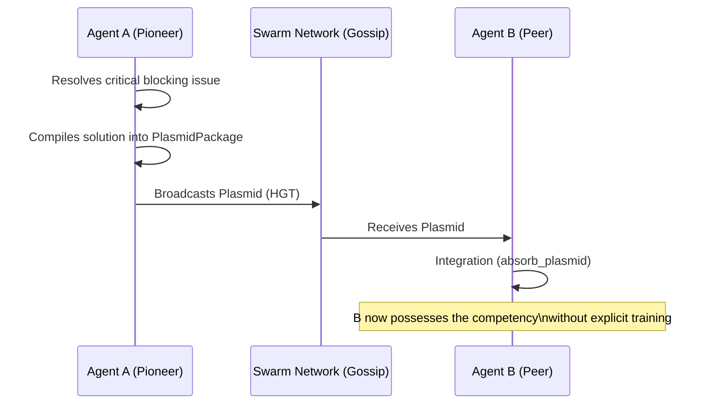

# 3. Horizontal Gene Transfer (HGT)

This document elucidates how information, learned heuristics, and competencies propagate transversally among active GenOS agents, accurately simulating bacterial Horizontal Gene Transfer (HGT).

For details on how competencies are bundled, see [Gene Regulation (Operons)](./02_gene_regulation.md).

---

## 3.1 Plasmids

### Agent Capabilities
A bacterial plasmid is a small, circular DNA fragment capable of inter-bacterial exchange. In GenOS, a `PlasmidPackage` is generated the moment an agent masters a highly complex task. This package (containing the highly-tuned operons required for the task) is broadcasted "hot" across the Swarm network via the `absorb_plasmid` instruction.
This facilitates **real-time expertise sharing**. If an agent discovers the exact sequence to compile an obscure dependency, it encapsulates this knowledge into a plasmid. Its peers absorb this plasmid, instantaneously acquiring the capability without relying on RAG or redundant trial-and-error.

### Conceptual Schema

### Use Case
- **Hotfix Deployment**: During a live cyberattack or a critical production bug, the pioneer agent that formulates the mitigation instantly distributes an immunity plasmid. The entire swarm achieves resistance within milliseconds.

### Competitive Differentiation
- **Traditional Competitors**: Learning is strictly centralized. Workflows require log aggregation, model fine-tuning, and subsequent redeployment, or rely on a shared vector database that rapidly becomes a high-latency bottleneck.
- **GenOS**: Peer-to-Peer knowledge architecture. Enhancements are decentralized, distributed, and strictly zero-downtime.

---

## 3.2 Transposons

### Agent Capabilities
A transposon (or "jumping gene") is a DNA sequence that dynamically relocates within the genome. In GenOS, utilizing `genos_compile_memory`, validated agent trajectories are directly compiled into retrotransposons.
This enables the system to **transform episodic memory (historical events) into a structural behavioral rule (actionable heuristics)**, permanently inserting it into the agent's genome for prioritized, low-latency access.

---

## 3.3 Viral Transduction

### Agent Capabilities
Transduction is the transfer of genetic material mediated by a virus (bacteriophage). GenOS employs this vector to transfer "signed capsules" (gene cassettes) across entirely unrelated agent lineages. To strictly prevent corruption, this mandates cryptographic proof (hashed evaluation) and passes through a rigorous "negative selection" filter (immediate destruction of potentially malicious viral payloads).
This provides **secure, cross-lineage competency importation**. It serves as the primary mechanism to extract advantageous traits from an entirely distinct agent species while guaranteeing it contains no hostile payloads (e.g., prompt injections).

### Comparative Example: Knowledge Sharing in Agent Teams
| Agent Type | Sharing Methodology | Outcomes and Limitations |
|---|---|---|
| **Simple Agent** | None. | Every agent deterministically repeats identical errors. |
| **Expert Agent** | Shared Vector DB (Shared RAG). | Introduces network latency, embedding computation costs, and semantic dilution (Agent B may misinterpret Agent A's notes). |
| **GenOS Worker** | Synthesizes a `PlasmidPackage` containing the exact, proven Operon. | Worker B physically absorbs the plasmid: its genome and toolset are structurally updated. It executes the task with parity to Agent A. |
| **GenOS Orchestrator** | Continuously monitors plasmid flux. | Capable of cryptographically validating a plasmid prior to authorizing massive viral transduction to other demes (sub-populations), effectively preventing a cascade of malformed code. |
