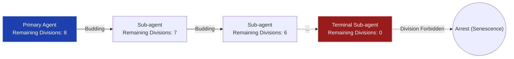

# 01. Cell Division: Scale-Out Dynamics

This document details how GenOS agents autonomously replicate (scale-out) to handle complex cognitive workloads, drawing direct inspiration from biological cellular division mechanisms. This process is tightly regulated by the [Hayflick Limit and Telomere Erosion](07_telomere_erosion.md) to prevent runaway resource consumption.

---

## 1. Core Replication Strategies

GenOS offers multiple distinct replication strategies, dynamically selected based on the requirements for security, consensus, or rapid exploration.

1. **Mitosis (`mitotic_fork_capsules`)**:
   Strict, deterministic duplication. The resulting clones perform a majority vote (consensus) which is validated bit-by-bit (byte-for-byte). If a single clone diverges (e.g., due to LLM hallucination), it is eliminated by the majority. This mode is ideal for highly critical, zero-fault tolerance tasks.

2. **Budding (Delegation)**:
   An agent isolates a sub-problem and spawns a specialized sub-agent to handle it. This delegation is strictly bounded by a **Hayflick Limit** (e.g., maximum 8 divisions), physically preventing infinite recursion, memory leaks, and explosive API cost overruns. For more on the regulatory mechanisms of this limit, see [Telomere Erosion](07_telomere_erosion.md).

3. **Schizogony (Speculative Fan-out)**:
   An atomic, speculative fan-out maneuver. A parent agent instantly fissions into $N$ distinct agents to simultaneously evaluate $N$ distinct hypotheses in parallel. This is highly effective for Monte Carlo Tree Search (MCTS) exploration phases.

4. **Amitosis (Forbidden by Design)**:
   Amitosis is cellular division without genomic verification. In GenOS, this unverified, naive threading (common in basic Python LLM wrappers) is explicitly forbidden. All divisions must pass strict architectural validations (see [Cell Cycle Checkpoints](04_cell_cycle_checkpoints.md)).

### Conceptual Schema: Budding and the Hayflick Limit

### Comparative Analysis: Recursive Dependency Tree Resolution

| Agent Architecture | System Behavior | Systemic Outcome |
| :--- | :--- | :--- |
| **Standard Naive Agent** | Executes a standard recursive "while True" loop to resolve dependencies. | Rapid progression toward a Stack Overflow or catastrophic token budget depletion. |
| **GenOS Worker Node** | Buds distinct sub-agents for each discovered dependency tree branch. | Gracefully halts upon reaching the Hayflick limit. The orchestrator is notified of depth anomalies, halting financial hemorrhage before cascading failure. |

## 2. Integration with Cellular Death
Should an agent fail its division verification or enter an infinite loop during a speculative fan-out, it is automatically terminated via [Apoptosis (Programmed Cell Death)](02_apoptosis.md) rather than leaving corrupted state artifacts.
