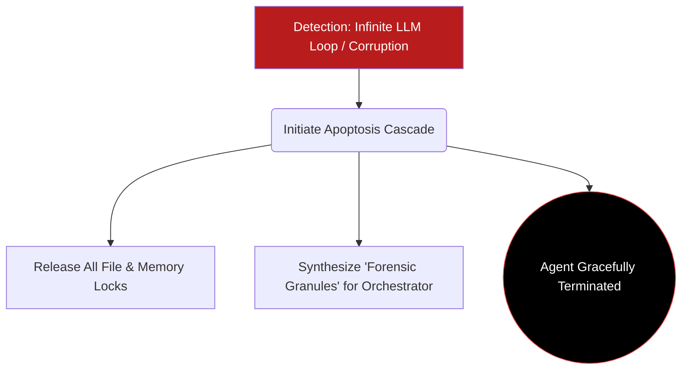

# 02. Cellular Death & Systemic Cleansing

The methodical elimination of deprecated, corrupted, or structurally compromised agents is mathematically as critical as their initial instantiation. GenOS architecture ensures that agent termination (cellular death) is a highly organized process that benefits systemic stability.

---

## 1. Apoptosis (Programmed Cell Death)

Unlike biological necrosis (analogous to an unhandled software crash that leaves behind locked files and corrupted memory states), **Apoptosis (`trigger_apoptosis`)** is an orchestrated, deterministic cellular suicide protocol.

If a GenOS agent detects an infinite LLM loop, a fatal semantic divergence, or encounters a viral capacity overflow, it instantly initiates self-destruction. This guarantees absolute **Fault Isolation (Containment)**. According to GenOS Theorems 1 & 2, apoptosis strictly bounds error cascades to a length of $1$. Errors mathematically cannot propagate across the broader agent swarm.

For details on the mechanisms that detect these fatal anomalies, refer to the [Cell Cycle Checkpoints](04_cell_cycle_checkpoints.md) and the ultimate enforcer, the [p53 Checkpoint](06_p53_checkpoint.md).

### Conceptual Schema: The Apoptotic Pathway

## 2. Phagocytosis and Autophagy (Systemic Cleansing)

Cellular death is only half the cycle; the resulting debris must be recycled. GenOS employs sophisticated mechanisms governed by [Homeostasis and Metabolism](03_homeostasis_metabolism.md).

- **Phagocytosis (Macrophage / Dead Letter Queue)**:
  The orchestrator deploys a 'Cleaner' process acting as an algorithmic macrophage. It aggressively ingests the *Dead Letter Queue* (DLQ), digesting and neutralizing orphan or corrupted asynchronous messages left behind by apoptotic agents.
  
- **Autophagy (`Autophagy.cleanup`)**:
  Acting as the systemic Garbage Collector (GC), the autophagic subsystem cleans up obsolete or highly fragmented workspaces and localized file states that clutter the storage layer, converting them back into available raw resources.

### Comparative Analysis: Infinite Loop Code Generation

| Agent Architecture | End-of-Life State | Systemic Impact |
| :--- | :--- | :--- |
| **Standard Scripting** | Out of Memory (OOM) crash or manual human intervention. | Partially written files, corrupted repository state, zero forensic traceability. |
| **GenOS Worker Node** | Algorithmic Nociceptors detect the critical infinite loop. Agent triggers autonomous Apoptosis. | Instantly executes a rollback on the final commit, writes a forensic autopsy to the telemetry bus, and safely terminates. |
| **GenOS Orchestrator** | Intercepts the forensic autopsy via the telemetry bus. | Deploys a Macrophage to purge associated message queues, then spawns a mutated, resilient Worker to bypass the original fault. Industrial-grade fault tolerance. |
