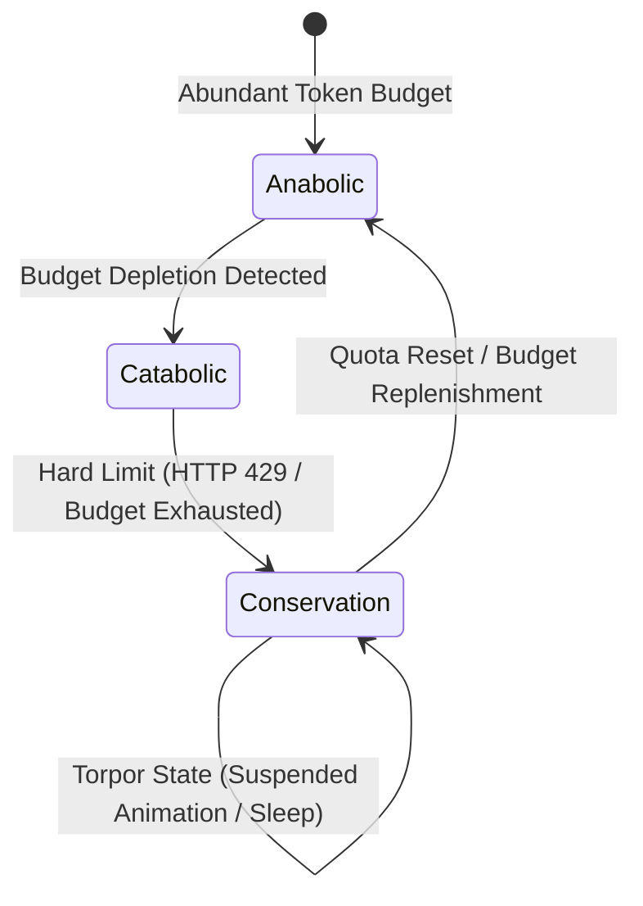

# 03. Homeostasis & Metabolism

This module outlines how the GenOS architecture maintains a stable internal equilibrium (e.g., API request rates, cognitive load, token expenditure) despite constant external perturbations and resource constraints.

---

## 1. AMPK (Energy Sensor) and Metabolic Torpor

Biological AMPK (AMP-activated protein kinase) acts as the fundamental cellular energy sensor, dynamically measuring the ATP/AMP ratio. In GenOS (`ampk.rs`), this concept translates to a real-time metabolic metric measuring the agent's financial and cognitive "load."

The AMPK sensor dynamically switches the agent between three metabolic states:

- **Anabolic Mode**: Resources (tokens, API quotas) are abundant. The agent engages in deep exploration, executing highly expansive Monte Carlo Tree Search (MCTS) algorithms and speculative fan-outs.
- **Catabolic Mode**: Resources are constrained. The agent suppresses deep exploration, defaulting to direct, highly economical problem-solving pathways.
- **Conservation Mode (Metabolic Torpor)**: Absolute resource limits are reached (e.g., HTTP 429 Rate-Limit). The agent enters a state of Torpor, initiating exponential backoff algorithms and aggressively pruning active working memory to minimize background footprint.

This biological mimicking provides flawless, autonomous **Rate-Limiting and Billing Management**. The agent "feels" its financial exhaustion and downregulates itself autonomously, entirely eliminating the need for rigid, hardcoded external throttling scripts.

### Conceptual Schema: AMPK State Machine

## 2. Turrigiano Homeostatic Scaling

In biological neural networks, unregulated synaptic strengthening can lead to hyper-excitability (e.g., epilepsy). Biologist Gina Turrigiano discovered "multiplicative scaling," a mechanism that globally normalizes synaptic weights to maintain network stability.

In GenOS (`prune_and_scale()`), this principle is applied to the agent's semantic memory graph. If a specific concept, file, or pattern is disproportionately accessed, its algorithmic "weights" are multiplicatively normalized toward a baseline target, while weaker, irrelevant links are pruned. 

This prevents **Attentional Collapse**. It mathematically guarantees that an agent does not become obsessively fixated on a single erroneous file or concept within a codebase, ensuring it maintains the cognitive flexibility to explore alternative solutions. For severe cases of irrecoverable cognitive collapse, the agent may initiate [Apoptosis](02_apoptosis.md).

### Comparative Analysis: Handling API Quota Exhaustion (HTTP 429)

| System Architecture | Reaction to Limit | Systemic Outcome |
| :--- | :--- | :--- |
| **Standard Agent** | Enters a high-frequency retry loop, spamming the endpoint. | Permanent IP ban by the API provider. Total systemic failure. |
| **Standard Expert System** | External wrapper enforces a rigid `time.sleep(60)`. | Agent is fully blocked. Active prompt contexts remain entirely loaded in RAM, unnecessarily freezing system resources. |
| **GenOS Worker Node** | The AMPK sensor detects the energy drop. Automatically initiates Conservation Mode (Torpor). | Prunes working memory (freeing RAM), halts expensive compute, and autonomously schedules a backoff wake-cycle. |
| **GenOS Orchestrator** | Observes the Worker entering Torpor. | Dynamically reroutes active traffic to alternative Workers utilizing disparate models/API providers (seamless fallback). |
