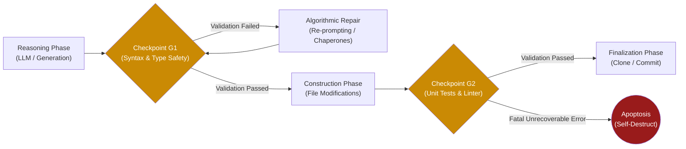

# 04. Cell Cycle Checkpoints

Drawing directly from biological eukaryotic cell division (mitosis), GenOS implements strict, non-negotiable checkpoints (analogous to G1, G2, and M phases). An agent must algorithmically validate these checkpoints before it can progress through its execution lifecycle, clone itself, or mutate code.

---

## 1. Security and Checkpoint Validation Architecture

In biological systems, cell cycle checkpoints verify DNA integrity prior to division, mathematically preventing the propagation of cellular malignancies (cancer). In the GenOS architecture, an agent is physically barred from advancing to subsequent execution states (e.g., committing code, deploying infrastructure, or executing a scale-out via [Cell Division](01_cell_division.md)) unless it fully satisfies the rigorous security, formatting, and logical assertions at each Checkpoint.

This architecture ensures the **mathematical impossibility of propagating an error state**. Unlike standard scripts that crash mid-execution leaving partial states, a GenOS agent is deterministically paused at the checkpoint boundary. If the payload is non-compliant, it immediately triggers repair mechanisms or invokes the [p53 Checkpoint](06_p53_checkpoint.md) protocols.

For instances of minor formatting errors, these checkpoints heavily rely on [Molecular Chaperones](05_molecular_chaperones.md) to automatically fold the data back into compliance.

### Conceptual Schema: The Execution Cycle

### Comparative Analysis: Pull Request Generation Lifecycle

| Agent Architecture | Systemic Mechanism | Resulting Outcome |
| :--- | :--- | :--- |
| **Standard Simple Agent** | Directly generates code and forcefully pushes the commit. | The GitHub CI pipeline fails catastrophically. Human intervention is required to debug. |
| **Prompt-Engineered Agent** | Relies on system prompt: "Ensure you verify your code before pushing." | The LLM frequently hallucinates compliance, bypasses verification, or lies about having tested the code. |
| **GenOS Worker Node** | Subjugated to architectural Checkpoints. The agent physically cannot transition to the "Commit" state if Checkpoint G2 (Tests & Linting) fails. | Commits are mathematically guaranteed to be 100% syntactically and logically valid prior to reaching the remote server. |

In the event of a critical violation of core directives (e.g., attempting to access forbidden secrets), the agent will encounter the specialized [p53 Checkpoint](06_p53_checkpoint.md), resulting in immediate [Apoptosis](02_apoptosis.md).
