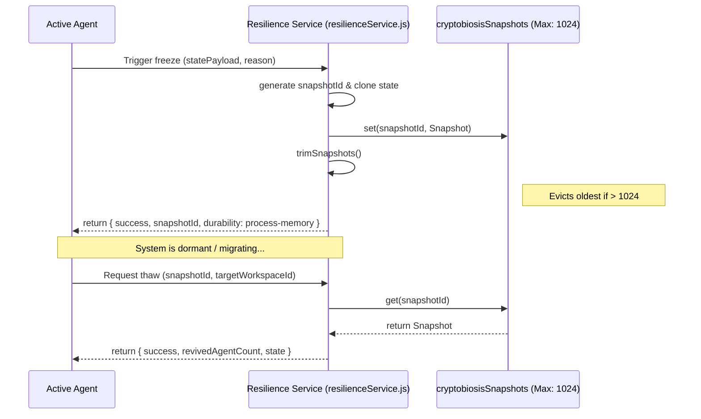

# Cryptobiosis

## Overview

In biological systems, **cryptobiosis** is a reversible state of metabolic suspension in response to adverse environmental conditions. Within the GenOS architecture, cryptobiosis represents the capability to freeze and serialize an agent's entire cognitive and operational state into a dormant snapshot. This mechanism allows for pausing, migrating, or recovering agents without losing context.

The implementation is grounded in the backend service `backend/src/services/resilienceService.js`.

## Core Mechanics

Cryptobiosis relies on capturing the state payload of an active workspace or agent fleet. These snapshots are kept in active memory up to a predefined limit to ensure rapid thaw times while preventing memory leaks.

### The Snapshot Data Structure

A cryptobiotic snapshot captures the holistic state of an agent or workspace. The structure contains:
- `snapshotId`: A unique identifier combining the timestamp and a random hash.
- `workspaceId`: The target environment or fleet context.
- `reason`: The contextual trigger for entering cryptobiosis (e.g., resource starvation, maintenance).
- `frozenAt`: An ISO-8601 timestamp indicating exactly when metabolic activity ceased.
- `state`: The deep-cloned JSON payload of the agent's internal state.

### Lifecycle Methods

The cryptobiosis lifecycle is governed by three primary operations:

1. **`freezeCryptobiosis(workspaceId, reason, statePayload)`**
   Captures the current state and suspends activity. The state is serialized and stored in a transient in-memory map.
2. **`thawCryptobiosis(snapshotId, targetWorkspaceId)`**
   Revives an agent or workspace from a specific snapshot. This reconstructs the active state and injects it into the target workspace context.
3. **`hydrateCryptobiosis(snapshot)`**
   Manually loads a durable snapshot back into the active runtime memory, typically used during system recovery or cross-node migration.

### Capacity Management

To maintain system homeostasis, the `cryptobiosisSnapshots` map is strictly bounded by the `MAX_CRYPTOBIOSIS_SNAPSHOTS` constant, which is set to **1024**. 
The `trimSnapshots()` function operates continuously to enforce this limit by evicting the oldest snapshots via LRU-style eviction (first-in, first-out mapping).

## Architectural Diagram

## Cross-References

- **Implementation details**: `backend/src/services/resilienceService.js`
- **Related biological analogs**:
  - [Apoptosis](./02_apoptosis.md) for terminal shutdown pathways.
  - [Homeostasis](./03_homeostasis_metabolism.md) for metabolic limits.
