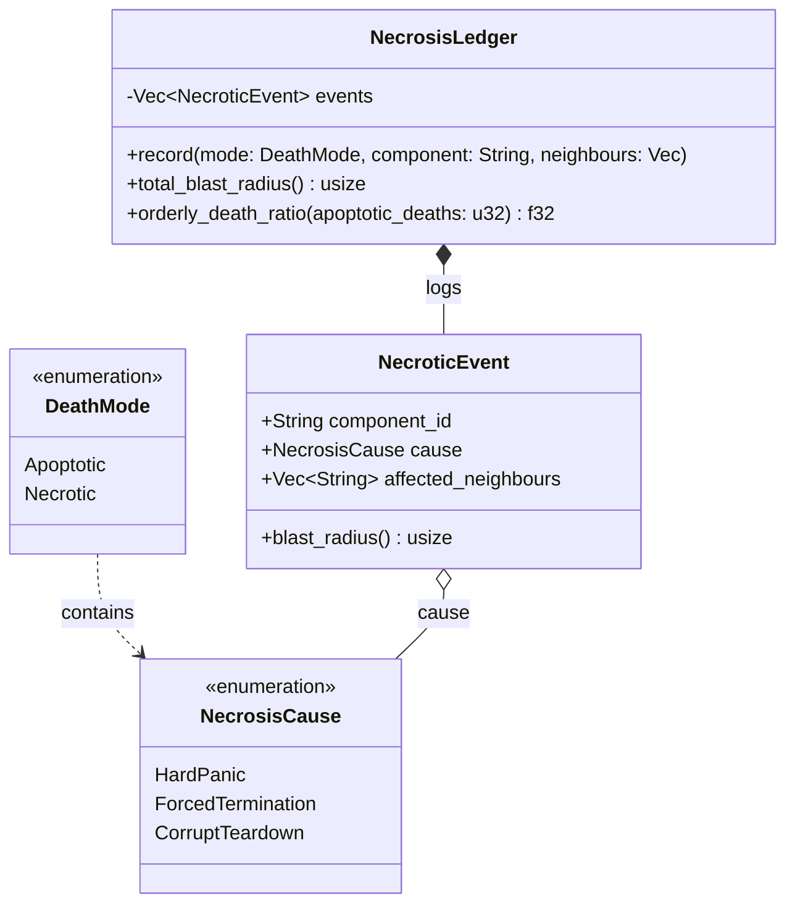

# Necrosis Ledger

## Overview

In the GenOS resilience architecture, **Necrosis** is the anti-pattern to [Apoptosis](./02_apoptosis.md). While apoptosis is the ordered, clean teardown of an agent via the Caspase cascade, necrosis represents an uncontrolled, chaotic component death. 

When an agent suffers a necrotic death (e.g., hard panic, forced kill), its internal contents and corrupted state "spill" onto neighboring components. The **Necrosis Ledger** is the subsystem responsible for measuring and tracking these catastrophic events to enforce resilience policies.

## Death Modes and Causes

The `DeathMode` enum distinguishes between orderly and chaotic deaths:
- `Apoptotic`: Ordered death through the caspase pipeline, yielding zero spillover.
- `Necrotic`: Uncontrolled death defined by a `NecrosisCause`.

### Causes of Necrosis
1. **`HardPanic`**: An unrecoverable panic that completely bypasses the apoptosis receiver.
2. **`ForcedTermination`**: An external, abrupt kill signal issued while critical locks were still held.
3. **`CorruptTeardown`**: The component's state is too corrupted to execute the standard clean-shutdown path.

## The Necrosis Ledger & Blast Radius

The `NecrosisLedger` acts as a registry for necrotic incidents. Apoptotic deaths do not pollute the ledger, but are instead counted as healthy statistics. 

When a necrotic event occurs, it is recorded as a `NecroticEvent`:
- `component_id`: The ID of the failed component.
- `cause`: The specific `NecrosisCause`.
- `affected_neighbours`: A list of surrounding components contaminated by the spillover.

The **Blast Radius** of a necrotic event is strictly defined as the number of neighbors contaminated by the spill (`affected_neighbours.len()`).

### Health Metric: Orderly Death Ratio

The ledger evaluates system health by calculating the **Orderly Death Ratio**:
`Ratio = Apoptotic Deaths / (Apoptotic Deaths + Necrotic Events)`

- A healthy system trends toward **1.0**.
- A ratio **below 0.5** flags the system as unhealthy. In such cases, the runtime should invest in better apoptosis coverage (e.g., utilizing `catch_unwind`, conducting lock audits) rather than continuing to spawn fragile agents.

## Architectural Diagram

## Cross-References

- **Implementation details**: `crates/genos-core/src/resilience/necrosis.rs`, `crates/genos-core/src/resilience/caspase.rs`
- **Related biological analogs**:
  - [Apoptosis](./02_apoptosis.md) for the ordered Caspase cascade teardown mechanism.
