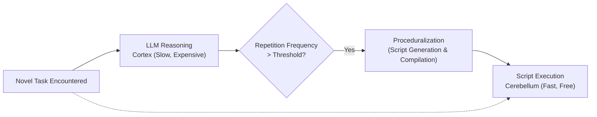

# 02. Cerebellar Proceduralization

This document details how GenOS offloads repetitive, deterministic cognitive tasks from the LLM (the Cortex) by transcribing them into highly efficient, hardcoded scripts, emulating the function of the human Cerebellum.

---

## 2.1 Automation of Cognitive Reflexes

### Cognitive Significance and Agent Augmentation
In GenOS, this biological elegance translates to a process called **Proceduralization**. If a cortical LLM Agent performs the same sequential reasoning pattern repeatedly, GenOS detects this repetition. It then automatically compiles this high-level reasoning into a deterministic, programmatic function.

This brings about a **collapse in inference costs**. A task that previously required thousands of tokens is distilled into an algorithmic reflex.

See also: [11. Cerebellum Micro-Timing](11_cerebellum_micro_timing.md) for temporal execution details, and [04. Hippocampal Circadian Replay](04_hippocampal_circadian_replay.md).

### Conceptual Schema

