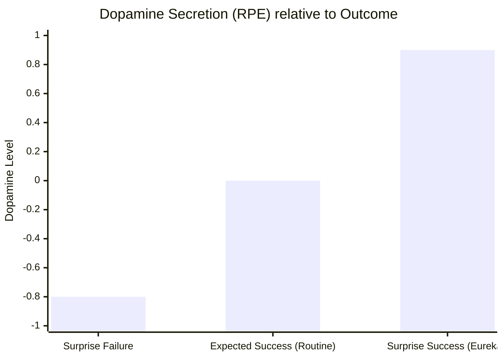

# 03. Dopaminergic RPE (Reward Prediction Error)

GenOS natively integrates the fundamental biological mechanic of reinforcement learning: the Reward Prediction Error (RPE), modeled through dopaminergic signaling.

---

## 3.1 Learning via RPE

### Cognitive Significance and Agent Augmentation
Whenever a GenOS agent undertakes an action, it emits an internal prediction regarding the anticipated success of that action:

- **Success > Prediction (Positive Surprise):** Triggers a massive **Dopamine Spike**. The agent violently reinforces the neuronal/synaptic pathway (via STDP).
- **Success == Prediction (Routine Mastery):** Results in **Zero Dopamine**. The agent recognizes that it fully masters this domain.
- **Success < Prediction (Negative Surprise):** Causes a **Dopamine Dip** (Synaptic Depression). The agent actively unlearns the faulty assumption.

This ensures **hyper-focused learning centered exclusively on the unknown**. The agent learns *only* from its surprises, maximizing token efficiency.

### Conceptual Schema

