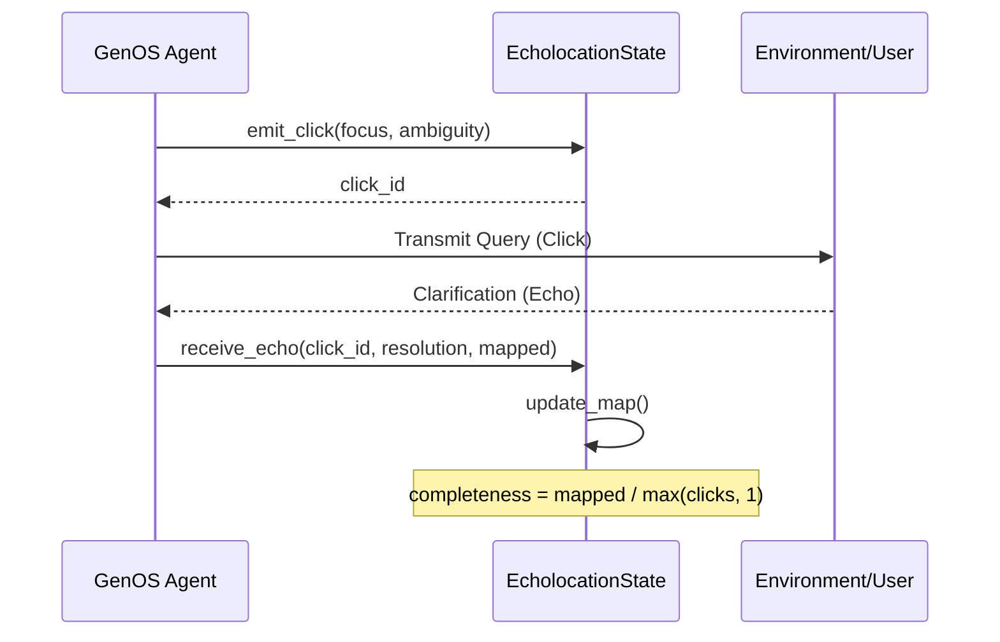

# Active Sensing & Echolocation

Active Sensing (or Echolocation) is a biomimetic requirement gathering strategy within the GenOS ecosystem. By replacing traditional, monolithic "grill-me" interrogation patterns with rapid, targeted clarification "clicks", agents can dynamically map an ambiguous constraint space.

## Architecture

The system revolves around three core structures defined in `crates/genos-core/src/biomimicry/active_sensing.rs`:

1. **`SensingClick`**: Represents an outgoing query targeting a specific ambiguity.
   - `id`: Unique identifier for the click.
   - `focus`: The conceptual area being probed.
   - `ambiguity_level`: A quantifiable metric of uncertainty ($f32$).

2. **`EchoResponse`**: The returned signal after a click strikes the user or environment.
   - `click_id`: Corresponds to the emitted `SensingClick`.
   - `resolution`: The data or clarification obtained.
   - `constraint_mapped`: A boolean indicating if a definitive constraint was established.

3. **`EcholocationState`**: The centralized state manager holding the topological map of constraints.
   - Maintains vectors of `clicks` and `echoes`.
   - Tracks `map_completeness`, which is the ratio of successfully mapped constraints to total emitted clicks.

## Data Flow

## Mechanisms

The agent emits clicks into the constraint space whenever `ambiguity_level` exceeds a defined threshold. Each echo returned allows the `EcholocationState` to update the `map_completeness`. Once `map_completeness` reaches a satisfactory level, the constraint space is considered fully mapped, and downstream code generation or planning can safely proceed.
