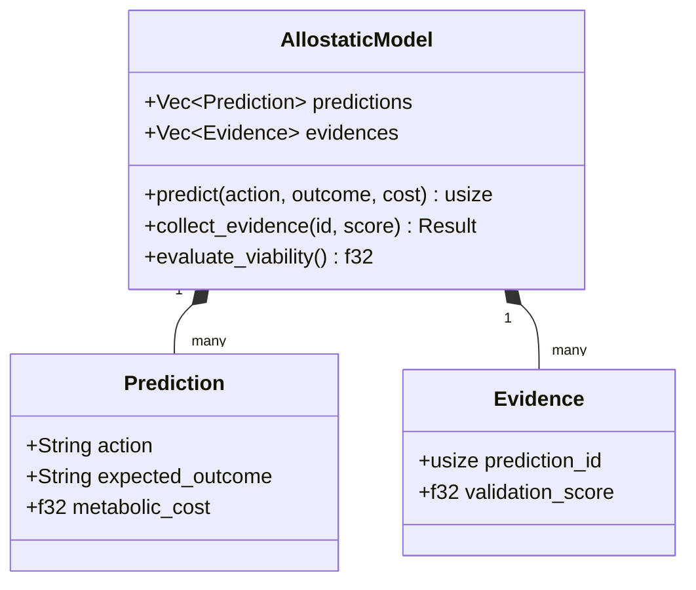

# Allostatic Planning

Allostatic Planning in GenOS represents a shift from reactive homeostasis to proactive, predictive coding and allostasis. Instead of acting blindly and reacting to failures, GenOS agents launch predictive simulations to evaluate metabolic costs and expected outcomes before committing to expensive token consumption.

## Architecture

The module `crates/genos-core/src/biomimicry/allostatic_planning.rs` implements this pattern using the following entities:

1. **`Prediction`**: A forward-looking model of an intended action.
   - `action`: The proposed operation.
   - `expected_outcome`: The anticipated state resulting from the action.
   - `metabolic_cost`: The projected resource (e.g., token) usage ($f32$).

2. **`Evidence`**: Data collected from simulations or environmental feedback validating a prediction.
   - `prediction_id`: Links to the original `Prediction`.
   - `validation_score`: A metric ($f32$) indicating the accuracy or viability of the prediction.

3. **`AllostaticModel`**: The core evaluation engine.
   - Stores `predictions` and `evidences`.
   - Calculates the overall viability of the planned actions based on accumulated evidence.

## System Dynamics

## Lifecycle

1. **Prediction Phase**: The agent registers a potential action via `AllostaticModel::predict`, forecasting the expected outcome and metabolic cost.
2. **Evidence Collection**: Through dry runs, static analysis, or historical data, the agent gathers `Evidence` and submits it via `collect_evidence`.
3. **Viability Evaluation**: `evaluate_viability` calculates the average validation score across all evidence. If the viability score exceeds the metabolic threshold, the agent executes the action.
