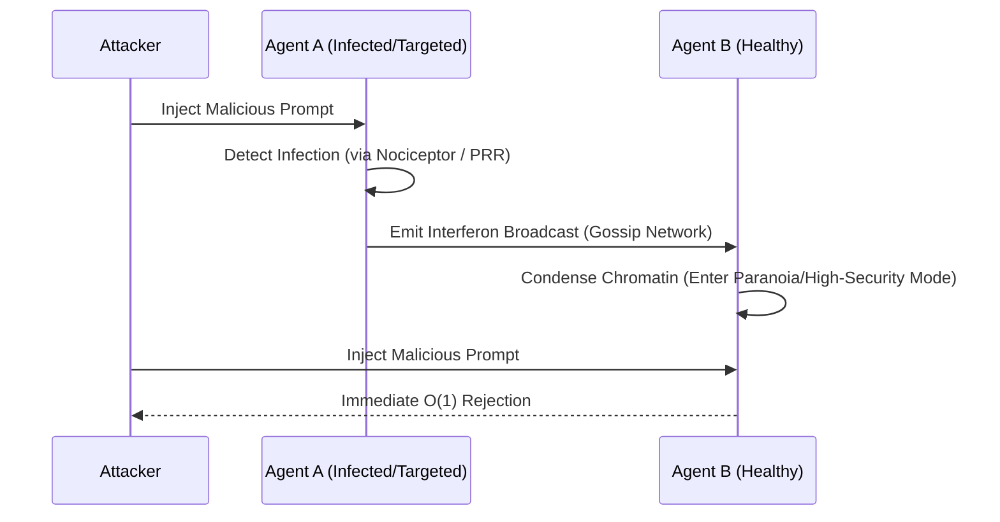

# 03. Advanced Immunology

This document consolidates recently implemented advanced immunological concepts within the GenOS architecture: Vaccination, Interferons, and Systemic Acquired Resistance (SAR). These mechanisms expand upon the core defenses detailed in [02_immunology.md](02_immunology.md).

---

## 3.1 Vaccination and Immunological Memory

### Systemic Advantages

GenOS simulates the injection of an "attenuated virus" (a weakened, inert, or structurally analyzed malicious prompt) during an agent's training phase or active lifecycle. The agent's artificial immune system analyzes this benign threat, registers its structural motifs in its "Immunological Memory Registry," and generates specific antibodies (rejection heuristics).

This confers **Proactive Immunity**. The agent does not need to suffer a critical failure or "die" from an attack to learn how to defend against it. It develops preemptive resistance, enhancing the overall robustness of the swarm.

---

## 3.2 Interferons

### Systemic Advantages

In biological systems, when a cell is infected, it secretes interferons: chemical alarm signals that instruct neighboring cells to reinforce their defenses because a virus is present in the environment.

Within GenOS, if Agent A is subjected to an attack (e.g., an attempted Jailbreak or sophisticated Prompt Injection), it immediately broadcasts an Interferon signal across the network (via the Gossip Node). Agents B, C, and D, upon receiving this signal, instantaneously elevate the severity of their security filters, checkpoints, and validation protocols—even before they encounter the attacker.

This provides **Instantaneous Collective Defense**.

### Conceptual Diagram: Interferon Signaling

---

## 3.3 Heritable Systemic Acquired Resistance (SAR)

### Systemic Advantages

This concept is highly prevalent in plant biology, where an attack on a single leaf can render the entire plant resistant, and this acquired resistance can be transmitted to subsequent generations via seeds.

In GenOS (implemented within `sar.rs`), a systemic resistance acquired by the swarm durably alters the phenotype of future agent generations. This operates through a mechanism akin to Lamarckian epigenetic inheritance. Immunity is no longer merely a temporary cache or transient state; it becomes structurally embedded within the source code and configuration templates of the swarm.

For related defensive mechanisms, see the innate responses detailed in [04_prr_pamp_damp.md](04_prr_pamp_damp.md).
