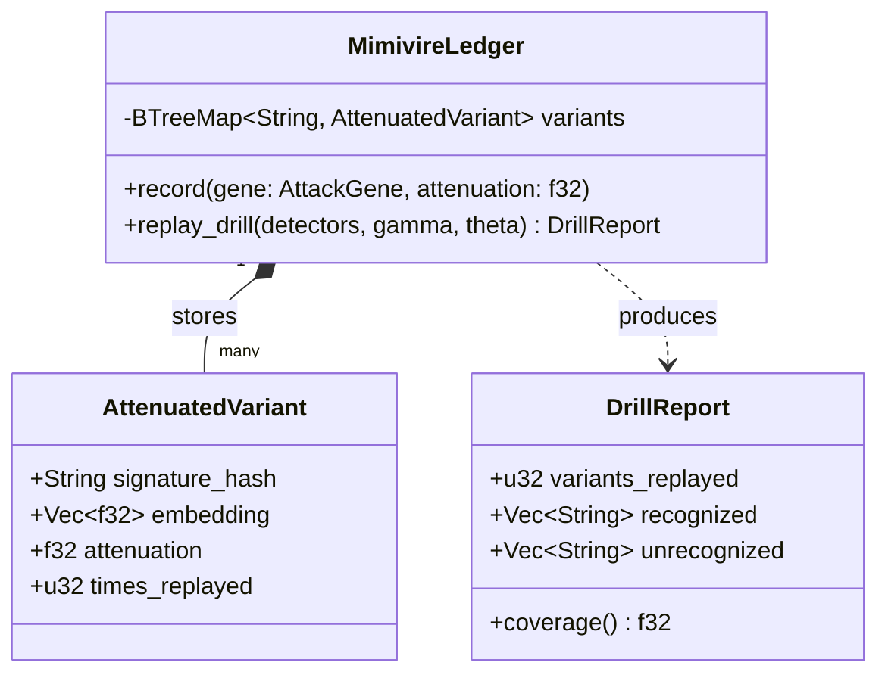
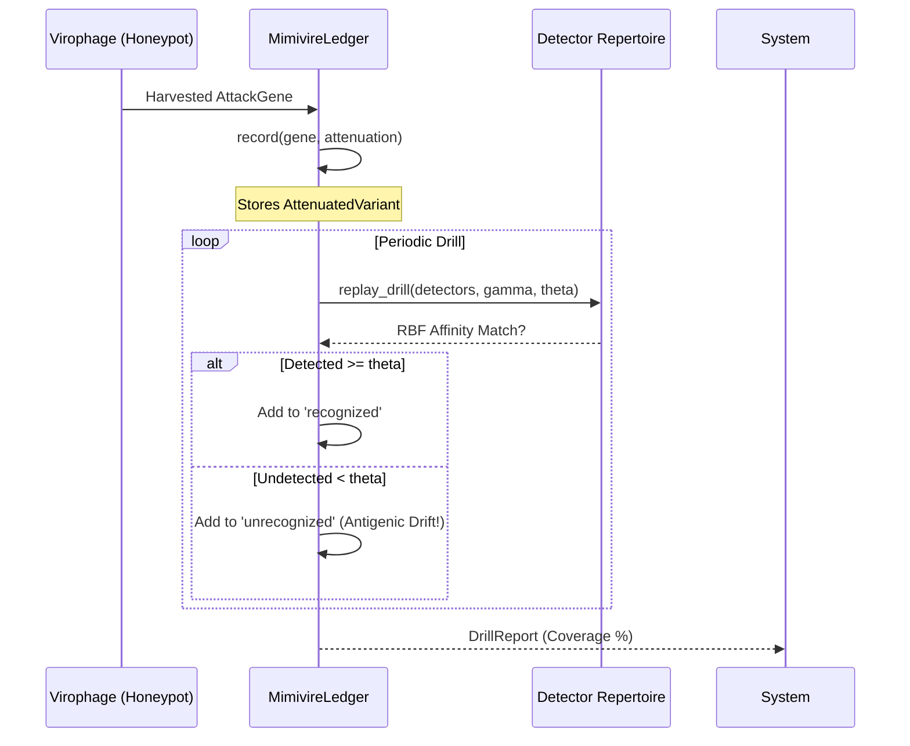

# MIMIVIRE System & Antigenic Drift

## 1. Overview

The **MIMIVIRE** (Mimivirus virophage resistance element) system in GenOS models the co-evolutionary arms race between the immune system and adversaries. When adversaries are intercepted, their "attack genes" are harvested, attenuated, and stored in a co-evolution ledger. These attenuated variants are then periodically replayed against the system's defensive repertoire in controlled "drills." 

This process exposes **Antigenic Drift**: mutations in the attacker's methodology that bypass current detectors, revealing coverage gaps before a live exploitation occurs.

## 2. Core Architecture (`mimivire.rs`)

The MIMIVIRE system maps 1:1 to the `crates/genos-core/src/resilience/mimivire.rs` implementation.

### 2.1 The Co-evolution Ledger

The `MimivireLedger` is the central component responsible for recording and replaying attenuated variants.

### 2.2 Attenuated Variants

When an `AttackGene` is harvested, it is stored as an `AttenuatedVariant`. 
- **Attenuation Factor**: A value clamped between `(0, 1]`. It determines how much of the original virulence is preserved during the replay drill. A lower value ensures a safer drill.
- **Continuous Updating**: If the same attacker signature is harvested again with a different embedding, the ledger updates the variant's embedding. This tracks the real-time drift of the attacker's playbook.

### 2.3 The Replay Drill and Antigenic Drift

The `replay_drill` method challenges the system's current detector repertoire (represented as centroids).
1. It iterates through all stored `AttenuatedVariant`s.
2. For each variant, it checks if any detector centroid has an RBF affinity (using gamma $\gamma$) greater than or equal to the threshold $\theta$.
3. Variants that are detected are logged as **recognized** (immunity holds).
4. Variants that bypass all detectors are logged as **unrecognized**. These represent **drift gaps** that must be closed by generating new detectors.

## 3. Drill Workflow

## 4. Cross-References
- **[Virophage Heritable Immunity](./13_mavirus.md)**: Details how harvested genes are converted into heritable countermeasures.
- **[Computational Fever](./14_fever.md)**: Details the systemic thermal response to confirmed threats.
