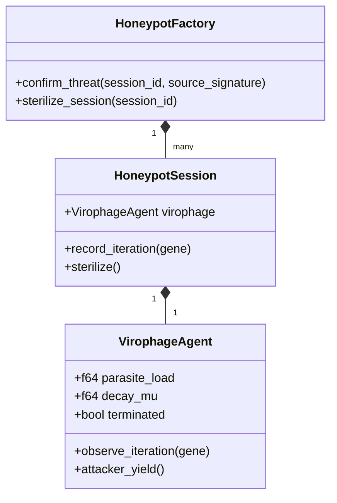
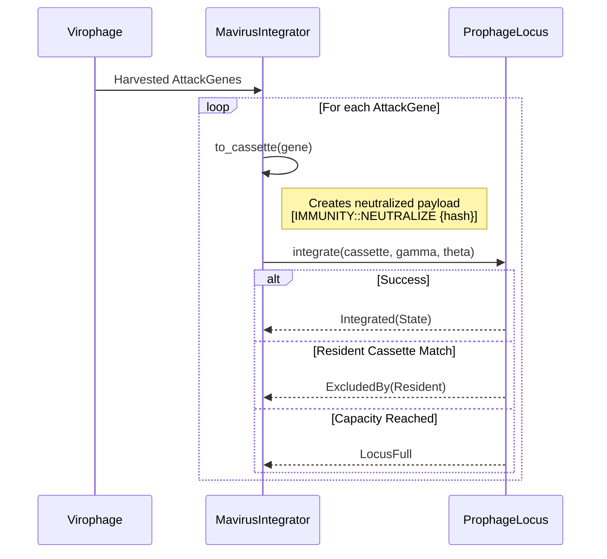

# Virophage & Mavirus Heritable Immunity

## 1. Overview

GenOS employs an active immunological strategy modeled after **Virophages** (such as the Mavirus). Rather than just blocking threats, the system deploys a parasitic agent (the Virophage) inside a honeypot session when a threat is confirmed. This parasite degrades the attacker's yield and harvests their methodology (`AttackGene`s).

The **Mavirus Integrator** then takes these harvested genes, neutralizes them, and integrates them into the lineage's prophage locus as dormant countermeasure cassettes. This provides **Heritable Immunity** across system forks.

## 2. Core Architecture

### 2.1 The Virophage Agent (`virophage.rs`)

When a threat is confirmed, a `HoneypotSession` is created, and a `VirophageAgent` is deployed.

- **Parasite Load**: Each observed playbook iteration increases the parasite load by 1.0.
- **Attacker Yield**: The effective propagation rate decays exponentially: $Yield = e^{-\mu \times Load}$.
- **Sterility & Apoptosis**: When the yield drops below `STERILE_EPSILON` (0.05), the honeypot is sterile. If the load exceeds `MAX_PARASITE_LOAD` (512.0), the virophage undergoes apoptosis, terminating the session.

### 2.2 Mavirus Heritable Immunity (`mavirus.rs`)

The `MavirusIntegrator` is responsible for processing the `AttackGene`s harvested by the Virophage.

- **Attenuation**: The raw attacker playbook is never stored. It is converted into a `SkillCassette` with a neutralized payload (`[IMMUNITY::NEUTRALIZE ...]`) and a `Dormant` state.
- **Integration Outcomes**: 
  - `Integrated`: Successfully stored in the locus.
  - `ExcludedBy`: Superinfection exclusion; a resident cassette with a highly similar failure mode signature already exists.
  - `LocusFull`: The locus has reached its maximum capacity.
  - `AlreadyIntegrated`: The integrator already processed this specific gene hash.

## 3. Cross-References
- **[MIMIVIRE System & Antigenic Drift](./12_mimivire.md)**: How harvested genes are used in safety drills to detect drift.
- **[Computational Fever](./14_fever.md)**: The systemic response triggered by confirmed threats before virophage deployment.
