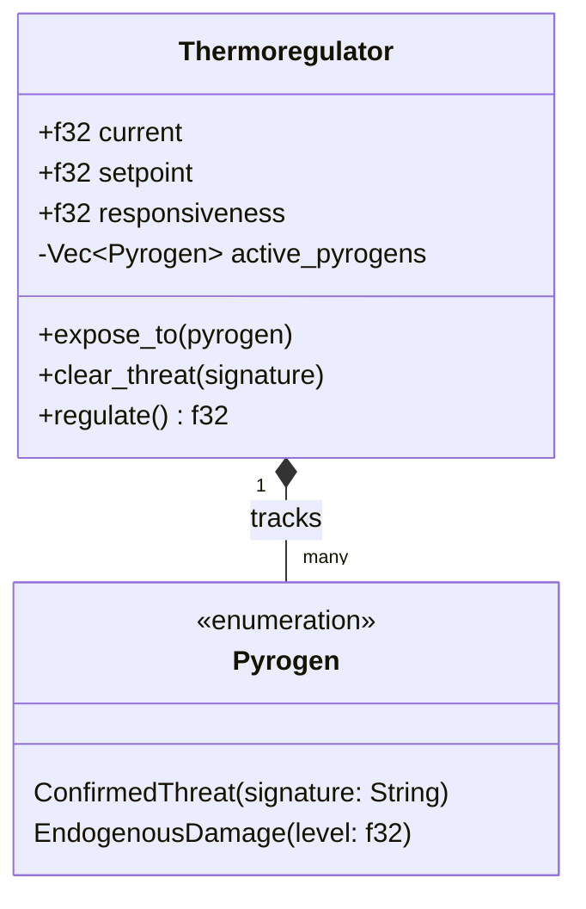
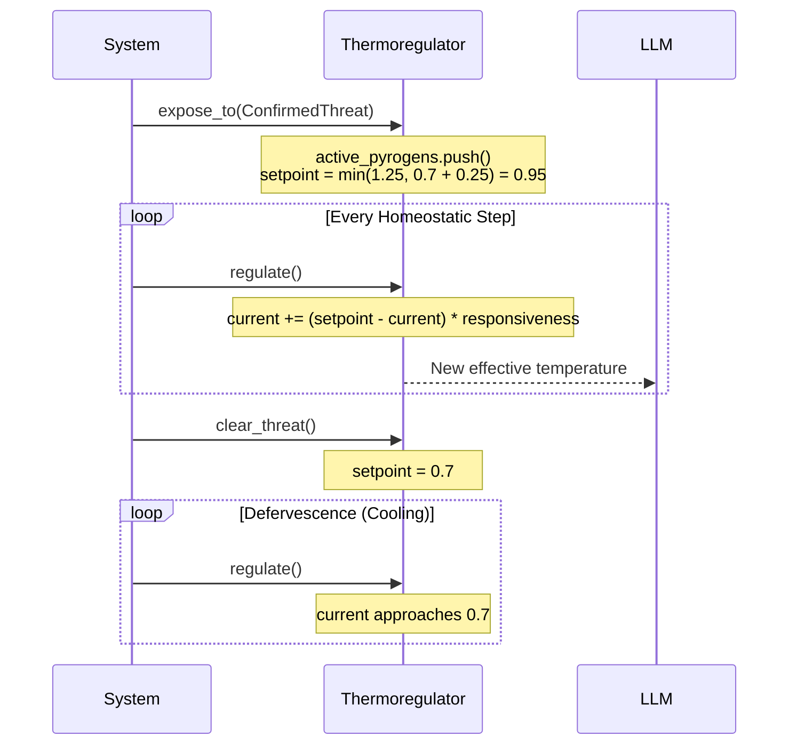

# Computational Fever & Pyrogens

## 1. Overview

In GenOS, **Computational Fever** is the systemic thermal response to active threats. When endogenous damage signals (DAMPs) or exogenous confirmed threats (PAMPs) are detected, they act as **Pyrogens**. These pyrogens elevate the system's "hypothalamic" thermal set-point.

The runtime responds by increasing the LLM's effective sampling temperature, trading precision for rapid exploration and mutational escape while the "infection" persists. Once the threat clears, the set-point drops, and the system cools down (defervescence).

## 2. Core Architecture (`fever.rs`)

The thermoregulation mechanism maps directly to the `Thermoregulator` component.

### 2.1 Pyrogens

Pyrogens are the triggers for fever. They come in two forms:
- `ConfirmedThreat`: An identified exogenous antigen (e.g., a specific injection signature). It raises the set-point by a flat `0.25`.
- `EndogenousDamage`: A stress signal originating from within (e.g., invariant breaches detected by Danger Telemetry / AIS). It raises the set-point proportionally: `0.25 * level`.

### 2.2 Thermoregulation Dynamics

The `Thermoregulator` manages the transition between normothermia and hyperpyrexia.

- **Baseline Temperature**: Normothermia is strictly defined as `0.7`.
- **Hyperpyrexia Cap**: The absolute maximum temperature allowed is `1.25`. Multiple pyrogens can stack, but the set-point will never exceed this cap.

### 2.3 The Homeostatic Step

The `regulate()` function is called periodically. It moves the `current` temperature towards the `setpoint` by a fraction defined by the `responsiveness` parameter (default `0.2`):

`current += (setpoint - current) * responsiveness`

This creates a smooth, asymptotic curve during both the onset of fever and the cooling phase, mimicking biological thermal inertia.

## 3. Cross-References
- **[MIMIVIRE System & Antigenic Drift](./12_mimivire.md)**: Drills to detect threats that might eventually cause fever.
- **[Virophage Heritable Immunity](./13_mavirus.md)**: The localized countermeasure deployed alongside the systemic fever response.
