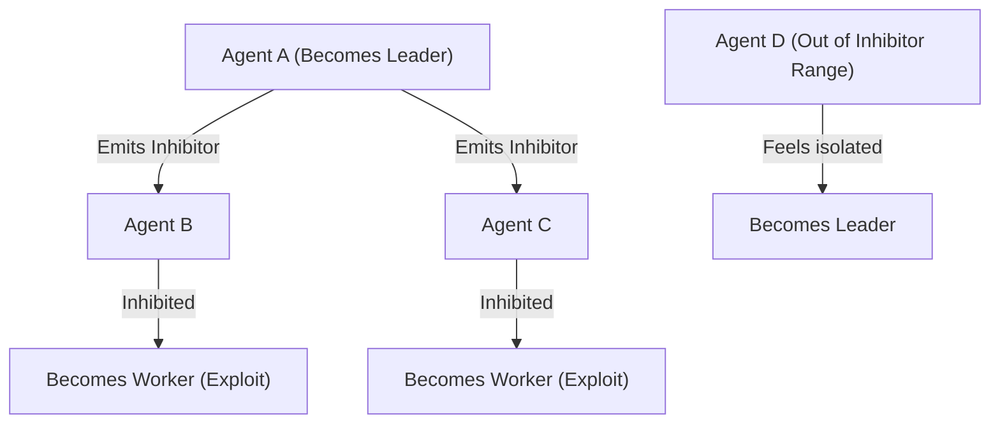

# Morphogenesis

The study of how complex structures emerge from simple, localized rules.

---

## Turing Patterns and Positional Information

### Implications for the Agent
How does a team of agents decide "who does what" without a central leader or static configuration? GenOS utilizes **Morphogen Gradients** (inspired by Wolpert's positional information) and **Reaction-Diffusion equations** (formulated by Alan Turing) to drive this decentralized decision-making process.

When an agent assumes the role of a "Leader", it emits an "Activator" signal (requesting assistance or drawing agents nearby) and an "Inhibitor" signal (preventing other agents from becoming Leaders in its immediate vicinity). The interplay between these signals creates an auto-stabilizing ratio within the swarm, typically maintaining an equilibrium of approximately 1 Leader for every 4 Workers (distributing roles across Explore, Exploit, and Idle states). 

This biological mechanism introduces **pure self-organization (Zero Central Bottleneck)** into the multi-agent system. The Orchestrator is relieved of micro-management duties; the team chemically structures itself dynamically based on the local environment and workload. For a broader view on spatial specialization, see the concept of [Hox Genes](03_hox_genes.md).

### Conceptual Schema

