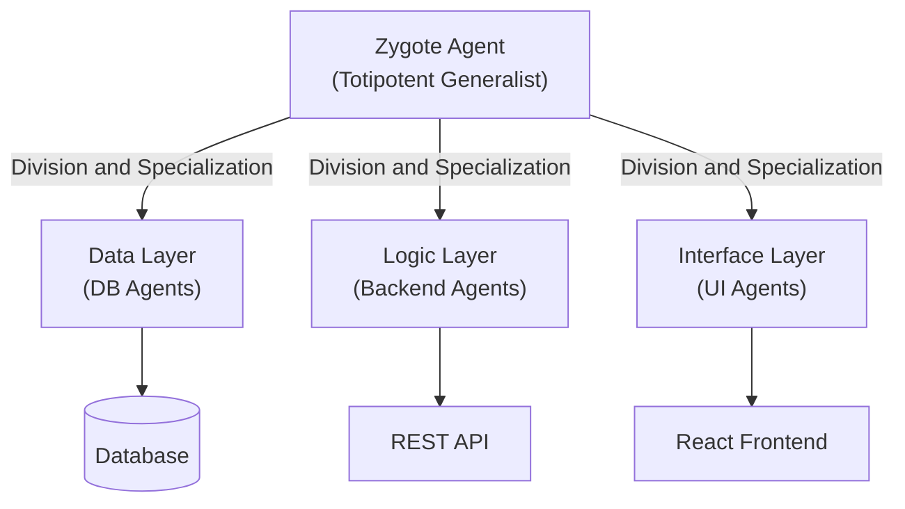

# Embryogenesis and Organizational Plans

The methodology by which GenOS creates complex systems (such as software architectures) is not a rigid "top-down" approach (writing everything at once from a rigid template), but rather a biological one: cellular growth starting from a "seed" or embryo.

---

## Code/Agent Embryogenesis

### Implications for the Agent
In traditional software development, large amounts of boilerplate are generated simultaneously via static templates or monolithic prompts. In GenOS, **Embryogenesis** signifies that the system initializes with a "Totipotent" agent (analogous to a zygote or egg cell) equipped with a fundamental "Organizational Plan". 

This initial agent undergoes division, and each subsequent sub-agent differentiates to construct and manage a specific domain of the project (e.g., Frontend, Backend, Database). 
This paradigm provides **architectural adaptability**. The organizational plan is fluid and highly responsive to its environment. If the "embryo" detects constrained memory resources, it dynamically adjusts its growth trajectory to generate a more lightweight architecture (e.g., opting for SQLite instead of PostgreSQL). For structural placement rules, refer to [Hox Genes](03_hox_genes.md). Once the system matures, it can undergo [Metamorphosis](04_metamorphosis_regeneration.md).

### Conceptual Schema

### Comparative Example: Starting a New Project
| Agent Type | Initial Action | Limitation |
|---|---|---|
| **Simple Agent** | Generates 50 files simultaneously via a massive prompt. | High hallucination rate, context loss, and incoherent code structure. |
| **Expert Agent** | Utilizes a fixed cookiecutter or predefined template. | Inflexible; unable to adapt if requirements deviate from the static template. |
| **GenOS Worker** | Behaves like an embryo: initializes, reads context, and buds new specialized agents. | The architecture grows organically, with each component strictly validated by the specialized agent that "grows" it. |
