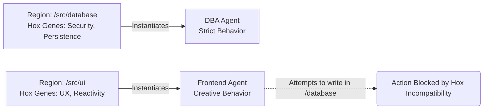

# Hox Genes (Architect Genes)

Hox genes (or homeotic genes) determine the anterior-posterior axis and segmental identity of an embryo's body plan (dictating where appendages like the head or legs should develop). GenOS draws inspiration from this biological mechanism to strictly govern the placement and behavior of software components.

---

## Structuring the Project Space

### Implications for the Agent
Within a repository, the "Hox Genes" of GenOS define distinct "regions" or territories within the codebase (e.g., the `src/api` region possesses different characteristics than `src/components`). 

When an agent mutates, buds, or navigates into the `src/api` region, the local Hox genes enforce a "Backend" phenotype, instilling traits such as rigor, security, and strict data validation. Conversely, if the agent operates in `src/components`, the regional Hox genes enforce a "Frontend" phenotype, prioritizing UI, accessibility, and reactivity. 

This confers **topographical awareness**. Agents never lose their contextual bearings within the project; their behavior, permissions, and coding style are intrinsically dictated by their "geographical" location. This aligns closely with the initial cellular differentiation seen in [Embryogenesis](02_embryogenesis_organization.md).

### Conceptual Schema

### Use Case
- **Prevention of "Spaghetti Code"**: An agent tasked with UI development cannot accidentally insert a direct SQL connection into a React component, because the "Hox Genes" governing the UI region strictly inhibit the expression of database-access capabilities.
