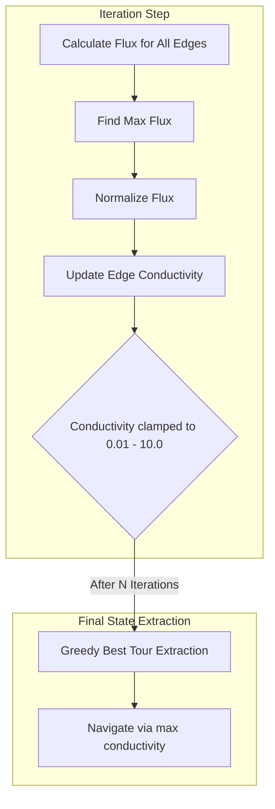

# Physarum TSP (Slime Mould Optimization)

## Overview

The `Physarum TSP` implementation within GenOS applies the biological pathfinding capabilities of the slime mould *Physarum polycephalum* to solve topological mapping and combinatorial optimization problems. 

This model simulates tubular network formation where the path with the highest flux becomes reinforced over time, allowing the system to discover optimal or near-optimal paths between nodes autonomously without global orchestration.

## Implementation Details

**Module:** `crates/genos-core/src/organization/physarum_tsp.rs`

The system operates on a fully connected graph representing nodes (`TspNode`) and edges (`PhysarumEdge`). Each edge has an associated length, flux, and conductivity.

### 1. Osmotic Flux (Hagen-Poiseuille Heuristic)

The agent network's flow distribution simulates the Hagen-Poiseuille law in biology. The flux through an edge is proportional to its current conductivity and inversely proportional to its physical length.

$$ Q_{edge} = \frac{Conductivity}{Length} $$

### 2. Adaptation and Autolysis

Edges with high flux are reinforced, simulating biological adaptation. Conversely, unused edges undergo **autolysis** (decay), gradually losing conductivity. 

During each iteration (`step()`):
1. **Flux Normalization**: The maximum flux in the graph is used to normalize local flows to prevent unbounded divergence.
2. **Conductivity Update**: 
   $C_{new} = C_{old} \times (1 - Decay) + (Flux_{normalized} \times Reinforcement)$
3. **Clamping**: The system limits conductivity tightly between `0.01` and `10.0` to preserve mathematical stability.

## Mermaid Architecture Diagram

## Greedy Tour Extraction

To produce actionable paths, the graph extracts a greedy tour (`get_best_tour`). Starting from an initial node, the algorithm greedily navigates to the unvisited neighbor connected via the edge bearing the highest current conductivity, effectively walking the biological slime's thickened "vein."
