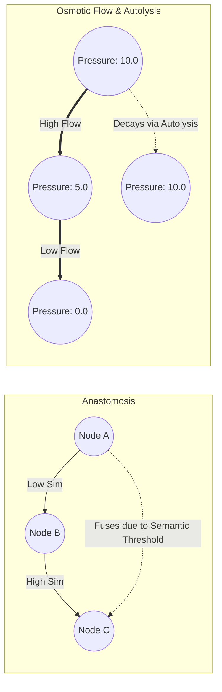

# Mycelial Networking

## Overview

The **Mycelial Networking** engine transposes the transport networks formed by fungi into a deterministic, decentralized topology router for agent meshes. It operates without a central controller, utilizing biological principles like Anastomosis, osmotic source-to-sink flow, and Kirchhoff conservation laws.

## Implementation Details

**Module:** `crates/genos-mycelium/src/lib.rs`

The network consists of named nodes (`BTreeMap<String, f32>`) and hyphal connections (`Hypha`), each maintaining properties like structural length, dynamic conductance, and last-used step.

### 1. Anastomosis (Semantic Fusion)

Fungal networks adapt their topology by fusing intersecting hyphae. In GenOS, this occurs when two edges exhibit high semantic similarity. 
The function `anastomose()` detects if the semantic correlation between edges exceeds a `gamma_similarity` threshold:
- If **Below Threshold**, they remain separate channels.
- If **Above Threshold**, the network fuses them, preserving the stronger conductance and averaging their lengths, eliminating redundant maintenance overhead.

### 2. Osmotic Routing & Kirchhoff Conservation

Flow operates deterministically via the modified Hagen-Poiseuille law:
$$Q = \frac{C}{L} \times \Delta P$$
Where $C$ is conductance, $L$ is length, and $\Delta P$ is the pressure gradient between source and sink nodes.

To prevent infinite loops, the system monitors **Kirchhoff conservation imbalances**. The net flow entering any node must closely approach 0 in a steady state, allowing early detection of routing anomalies (`worst_flow_imbalance`).

### 3. Autolysis & Reinforcement

A hypha unused for more than `max_idle_steps` is biochemically digested (autolyzed) to free resources. Conversely, successful message transfers reinforce the specific hypha's conductance.

## Biological Flow Diagram

