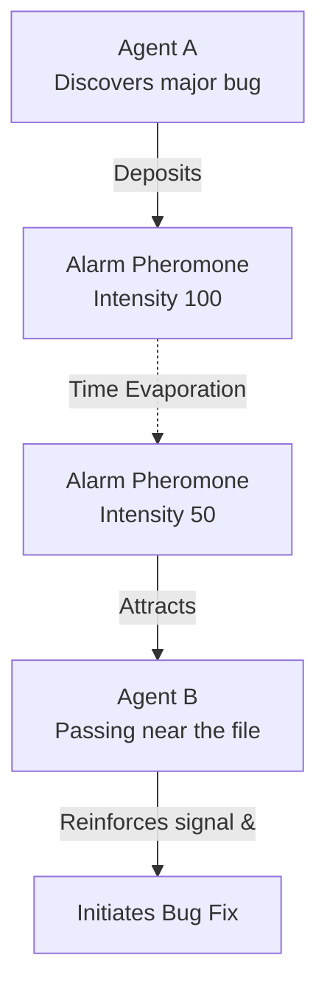

# Collective Intelligence & Ethology

GenOS relies on ethological principles to demonstrate how simple, localized agents following basic rules can generate highly sophisticated, superior group intelligence without top-down micromanagement.

---

## 1. Stigmergy (Pheromones) and Eusociality (Castes)

### Biological Inspiration
- **Stigmergy**: A mechanism of indirect coordination found in social insects (ants, termites). Rather than communicating directly, individuals modify their environment (e.g., by leaving pheromone trails), and these modifications stimulate subsequent actions by others.
- **Eusociality**: Advanced social organization characterized by a division of labor (castes), such as queens, workers, and soldiers (seen in bees, ants, and naked mole-rats).

### Application in GenOS Agents
Instead of relying on heavy, verbose direct messaging systems (like traditional Pub/Sub architectures), GenOS agents utilize **Stigmergy**.

- **Mechanism**: Agents deposit digital "pheromones" (e.g., Recruitment, Alarm) into a shared `SpatialMesh` (a virtual blackboard). These pheromones have a predefined half-life and "evaporate" over time, ensuring that outdated information naturally degrades. 
- **Caste Organization**: The swarm organizes itself into specific roles—Orchestrators (Queens), Workers, and Security Checkers (Soldiers)—or forms fluid "Flocks" governed by separation, alignment, and cohesion algorithms.
- **Impact**: This enables **silent, hyper-efficient collaboration**. Hundreds of agents can work on the same massive codebase simultaneously without becoming paralyzed by network latency or synchronization meetings.
- **Cross-Reference**: Trust and merit in these interactions are governed by [Reciprocal Altruism](04_reciprocal_altruism.md).

---

## 2. Conceptual Schema: Stigmergic Flow

---

## 3. Comparative Example: Problem Mobilization

| Architecture Type | Communication Protocol | System Impact |
| :--- | :--- | :--- |
| **Traditional Swarm** | "Hello B, could you help me with file X?" (Direct messaging, ~100 tokens per message). | Network saturates rapidly. If 50 agents communicate simultaneously, LLM context costs explode and latency spikes. |
| **GenOS Swarm** | Orchestrator delegates; Workers use stigmergy. | Worker A deposits a 1-byte pheromone on file X. Other Workers intuitively "smell" the gradient. Action is coordinated with near-zero network and token overhead. |
