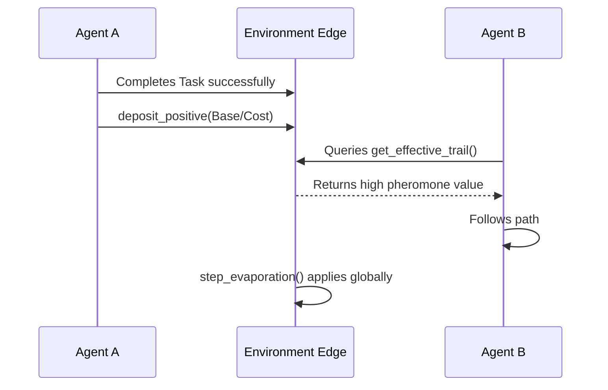

# Stigmergic Environmental Coordination

## Overview

Stigmergy is a biologically-inspired mechanism wherein agents communicate indirectly by leaving traces (pheromones) in their shared environment. Within GenOS, this facilitates headless consensus on Abstract Syntax Tree (AST) operations and workspace mutations.

## Implementation Details

**Module:** `crates/genos-core/src/biomimicry/stigmergy.rs`

The `StigmergyEngine` tracks digital pheromone deposits on directed edges (`PheromoneEdge`) between distinct workspace entities.

### 1. Pheromone Deposition

Rather than broadcasting messages, agents deposit chemical gradients that decay over time. 
- **Positive Deposit:** Reward for traversing an optimal path or utilizing a successful module. Calculated as $\frac{\text{Base Deposit}}{\text{Cost}}$. Lower cost operations yield stronger pheromones.
- **Negative Deposit:** Punishment for failure paths, exceptions, or timeouts. Adds a severity score directly to the negative trace.

### 2. Effective Trail Evaluation

The net desirability of any given AST transition is resolved through competitive evaluation:
$$ \text{Effective Trail} = \max(0.01, P_{positive} - (W_{penalty} \times P_{negative})) $$
The penalty weight ($W_{penalty}$) ensures adverse experiences rapidly override positive historical bias.

### 3. Temporal Evaporation

Pheromones inherently evaporate as epochs pass:
$$ P_{t+1} = P_{t} \times (1.0 - R_{evap}) $$
This continuous evaporation forces the system to forget obsolete successes and prevents local optimum traps.

## System Architecture

