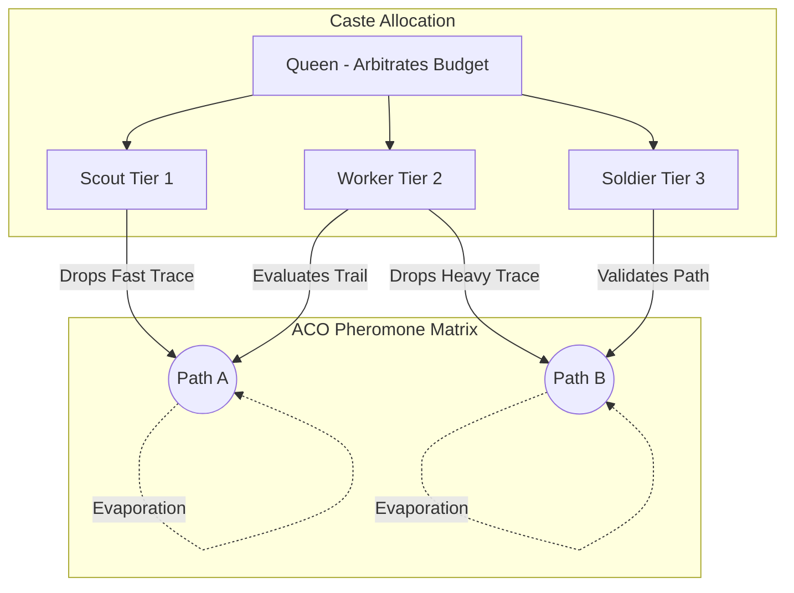

# Ant Colony Optimization & Age Polyethism

## Overview

By combining the probabilistic pathfinding of Ant Colony Optimization (ACO) with the hierarchical task allocation model of Age Polyethism, GenOS governs the deployment of Large Language Models (LLMs) according to their computational footprint and capability.

## Implementation Details

**Modules:** 
- `crates/genos-core/src/organization/aco.rs`
- `docs/3-features-and-domain/biomimicry/swarm.md`

### 1. Age Polyethism (ModelTier Task Allocation)

In nature, biological insects change castes based on maturity and capability. In GenOS, this reflects deterministic model selection to conserve token bandwidth:

| Caste | GenOS Role | Tier | Cost Weight | Focus |
|---|---|---|---|---|
| **Scout** | Code Scanner / Log Miner | Tier 1 (Flash) | $0.05\times$ | Low-entropy AST discovery and regex. |
| **Worker** | Implementer | Tier 2 (Pro) | $1.0\times$ | Logic synthesis and test creation. |
| **Soldier** | QA / Invariant Auditing | Tier 3 (Heavy) | $3.0\times$ | Security evaluation and mutation testing. |
| **Queen** | Quorum Arbiter | CPU | $0.0\times$ | Emergency tie-breaking and objective alignment. |

### 2. Ant Colony Optimization (ACO)

As agents (Scouts/Workers) navigate the architecture, they make probabilistic decisions constrained by pheromones ($\tau$) and a localized heuristic ($\eta$), often utilizing inverse distance or metadata density.

The probability of an agent choosing an edge $ij$ is given by:
$$ p_{ij} = \frac{\tau_{ij}^\alpha \times \eta_{ij}^\beta}{\sum \tau^\alpha \times \eta^\beta} $$

- **$\alpha$**: Focuses on historical pheromones.
- **$\beta$**: Focuses on immediate heuristic desirability.
- **Evaporation ($\rho$)**: Fades historical trails globally.

Agents that succeed return a proportional quality score, multiplying their pheromone deposit $q \times \frac{10}{2}$.

## ACO-Polyethism Interaction Architecture

