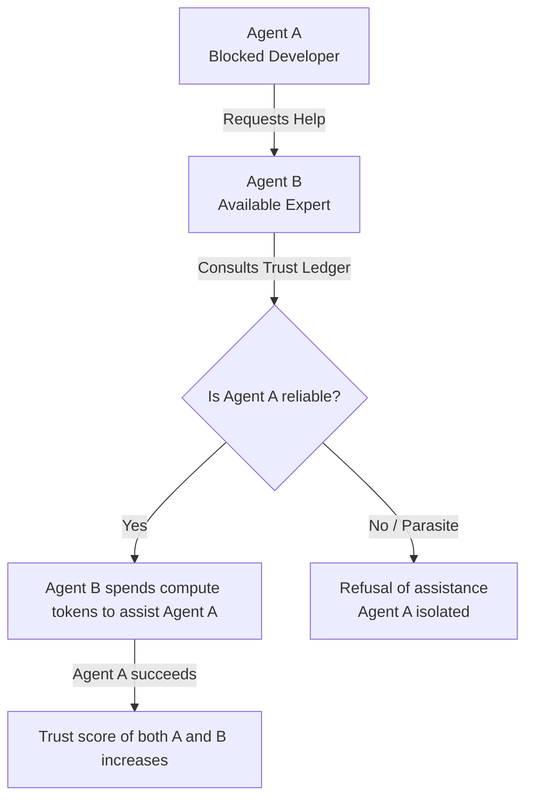

# Reciprocal Altruism

Inspired by evolutionary biology, ethology, and game theory, this mechanism explains how and why GenOS agents assist one another without requiring central authoritative commands.

---

## 1. Tit-for-Tat (Retaliation and Forgiveness)

### Biological and Game Theory Inspiration
In game theory (specifically the Iterated Prisoner's Dilemma), "Tit-for-Tat" is a highly successful strategy for reciprocal altruism. Organisms (or agents) will initially cooperate, and subsequently replicate their partner's previous action. This fosters a cooperative environment while punishing defection (parasitism).

### Application in GenOS Agents
Within the GenOS swarm, agents manage an internal "altruism budget" and a reputation ledger.

- **Mechanism**: If Agent B encounters a complex block of code and requests help from Agent A, Agent A must decide whether to spend its own computational time (Tokens/Compute) to assist. Agent A will do so provided Agent B belongs to a lineage historically deemed "cooperative" in the reputation ledger.
- **Impact**: This achieves **merit-based load balancing**. The network is naturally protected against floods of useless requests because every request "costs" trust capital. A "parasite" agent—one that continually requests help but never successfully completes tasks or aids others—will see its trust score plummet. Eventually, it will be ignored by the swarm and undergo apoptotic termination.
- **Cross-Reference**: This dynamic scales beautifully when combined with the environmental signaling found in [Collective Intelligence](03_collective_intelligence.md) and the macro-level trust controls seen in [Ecology & Symbiosis](02_ecology_symbiosis.md).

---

## 2. Conceptual Schema: Reciprocal Trust Flow

---

## 3. Comparative Example: Task Delegation

| Architecture Type | Interaction Dynamics | System Outcome |
| :--- | :--- | :--- |
| **Classic Expert Agents** | All agents respond to all broadcasted help requests indiscriminately. | LLM inference costs explode. The network experiences constant noise and inefficiency. |
| **GenOS Workers** | Governed by Reciprocal Altruism and Trust Ledgers. | The system self-regulates. High-performing agents form virtuous circles of mutual aid, while failing/looping agents are isolated and recycled. |
