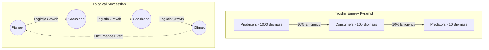

# Lindeman Energy Flow & Trophic Networks

## Overview

The Trophic module enforces strict population controls by treating compute capabilities and budget allocations as biological energy. Modeled after Lindeman's Law of 10% ecological energy transfer, it ensures stability by limiting predator/consumer resources strictly to the sustained bandwidth of the underlying producers.

## Implementation Details

**Module:** `crates/genos-eval/src/trophic.rs`

### 1. Trophic Roles & Efficiency

Entities are categorized by `TrophicRole`: `Producer`, `Consumer`, `Predator`, or `Decomposer`.
As compute budget ("biomass") is consumed vertically up the network, energy is inherently lost. The system codifies `ENERGY_TRANSFER_EFFICIENCY = 0.10`. 

For example, a Consumer operating on 500 units of Producer bandwidth will only generate a stable carrying capacity of 50 units for its own layer.

### 2. Coexistence Constraints

Population checks (`coexistence_violations`) operate as fixed-point iterations. The system calculates the theoretical carrying capacity bottom-up:
$$ C_{predator} = ( \sum_{inflow} \text{Biomass}_{prey} \times \text{Efficiency}_{capture} ) \times 0.10 $$

If any node population exceeds its computed biological capacity, a coexistence violation is flagged, preventing systemic out-of-memory cascades or budget runaways.

### 3. Ecological Succession

The ecosystem is not static; it evolves logistically over time, categorized into four progressive stages bounded by biomass thresholds (`STAGE_BIOMASS_THRESHOLDS = [50.0, 200.0, 600.0]`):
1. **Pioneer**: Biomass < 50
2. **Grassland**: Biomass < 200
3. **Shrubland**: Biomass < 600
4. **Climax**: Stabilization at maximal biotic limit.

Any critical failure or disturbance (`disturb()`) slashes the biomass multiplier and rapidly resets the network state toward the Pioneer phase to rebuild safely.

## Succession and Trophic Energy Diagram

