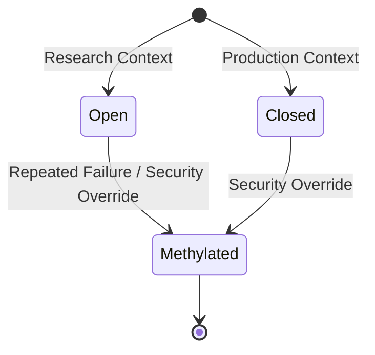

# Epigenetic Plasticity of the Griot Agent

Epigenetic plasticity is a foundational mechanism that enables the Griot agent to dynamically modify the expression of its underlying "genomic" structure—its core configuration, prompt blueprints, and cognitive modules—in direct response to environmental variables and accumulated operational experience.

For related concepts on how accumulated traits are passed down, refer to [Evolution and Heredity](./02_griot_evolution.md) and [Swarm Ecology](./05_griot_swarm_ecology.md).

## Environmental Impact on Genomic Expression

Griot's operational environment is strictly defined by its working directories, active configuration files, and the overarching context of user requests. Dependent upon these external variables, the agent's genome undergoes structural modifications analogous to chromatin remodeling at specific genomic loci:

- **Open (Euchromatin)**: Specific cognitive modules (e.g., `communication_module`, `creativity_module`) become highly active and accessible. This transcriptional activation occurs when the agent detects exploratory environments, such as research directories (`research/`) or unconstrained development sandboxes.
- **Closed (Heterochromatin)**: Loci are actively silenced. The agent dynamically restricts its creative or exploratory capabilities if the environment mandates strict adherence to protocol, such as when operating in production-critical directories (`deploy/`) or parsing rigid configuration constraints (`configs/strict.json`).
- **Methylated (Long-Term Repression)**: A persistent, durable repression of a specific locus. If a module fails repeatedly, or if an absolute security rule is enforced (e.g., directives found in `SECURITY.md`), the corresponding locus is methylated. This effectively inhibits the module in a stable manner across multiple execution cycles.

## Orchestration Tools

These epigenetic states can be precisely controlled, measured, and overridden via the sophisticated MCP tool `genos_biomimicry_epigenetic_chromatin`. This tool accepts three primary parameters:
- `agent_id`: The unique identifier of the target agent.
- `locus`: The specific genetic module or prompt segment.
- `state`: The desired epigenetic state (`open`, `closed`, or `methylated`).

This biomimetic architectural design affords unprecedented contextual flexibility, allowing the Griot agent to organically adapt its cognitive posture to the nuanced demands of its software ecosystem.

