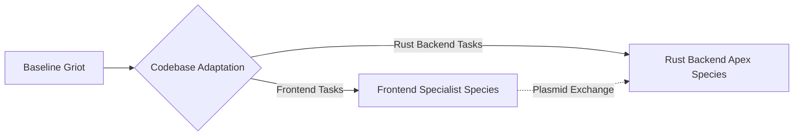

# Evolution and Heredity in GenOS

The Griot agent is fundamentally designed as a non-static, continuously evolving entity. As it executes tasks, it aggregates a profound repository of experience, highly optimized prompt structures, and intricate, project-specific heuristics. Rather than resetting and relearning these pathways upon every instantiation, GenOS leverages sophisticated biological heredity mechanisms to preserve and propagate advantageous traits.

This evolutionary process is tightly coupled with the agent's internal memory management, explored in [Memory Pruning](./03_griot_memory_pruning.md), and its developmental lifecycle, detailed in [Ontogeny](./04_griot_ontogeny.md).

## 1. Horizontal Gene Transfer (Plasmids)

Agents within the GenOS ecosystem possess the capability to exchange "plasmids"—encapsulated blocks of executable code, dense contextual memory, or newly discovered operational rules. If Agent `Griot_A` successfully identifies a novel workaround for a rare edge-case bug, it can automatically package this heuristic into a plasmid and transfer it directly to `Griot_B`. This ensures rapid, lateral dissemination of critical knowledge without requiring a centralized update push.
* **Primary MCP Tool**: `genos_evolution_assimilate_plasmid`

## 2. Speciation and Hyper-Specialization

When a Griot agent undergoes deep adaptation to a highly specific and complex codebase (for instance, a monolithic Rust backend system), its internal genetic configuration begins to significantly diverge from its baseline ancestral state. 

If this divergence crosses a critical systemic threshold (e.g., `divergence_threshold > 0.8`), the agent undergoes speciation. It is reclassified as a novel "species" of agent—hyper-specialized, immensely efficient, and entirely adapted to its niche. While this specialized agent may lose generalized capabilities (e.g., it can no longer effectively navigate modern Frontend frameworks), it becomes an unparalleled apex entity within its dedicated Backend environment.
* **Primary MCP Tool**: `genos_biomimicry_speciation_check`

