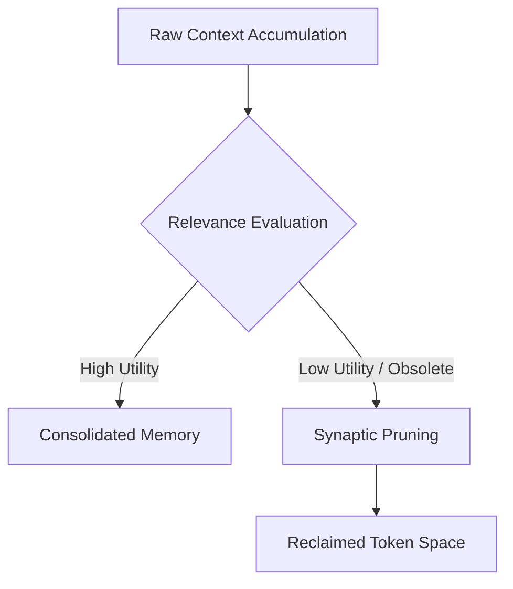

# Long-Term Memory Compression (Synaptic Pruning)

A GenOS agent operating as a continuous background daemon naturally accumulates an immense volume of conversational context and operational metadata. Without systemic intervention, this unchecked accumulation inevitably leads to severe performance degradation, cognitive fragmentation, and exponential token costs.

For information on how memory affects the agent's life cycle, refer to [Ontogeny](./04_griot_ontogeny.md) and [Epigenetic Plasticity](./01_griot_epigenetics.md).

## Synaptic Pruning Mechanism

Drawing direct inspiration from neurobiology—where underutilized neural synapses physically detach to optimize brain efficiency—GenOS incorporates a sophisticated pruning architecture. The `genos_synaptic_prune_scale` tool empowers the agent to autonomously evaluate the relevance, recency, and utility of its own internal synaptic connections (contextual data nodes).

Through this mechanism, the agent can intentionally "forget" obsolete structural patterns, deprecated API interactions, or temporary bug resolutions that have lost their operational relevance over time.

* **Primary MCP Tool**: `genos_synaptic_prune_scale`
* **Core Mechanism**: By systematically compressing or permanently severing obsolete contextual threads, Griot maintains an ultra-reactive cognitive state. This ensures that the agent remains exceptionally lightweight in its memory footprint and highly responsive, even after months or years of uninterrupted, continuous execution.

