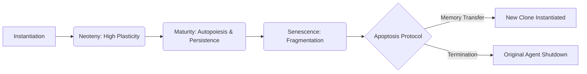

# Development and Senescence (Ontogeny)

The lifecycle of a Griot agent is not a flat timeline but a dynamic biological progression encompassing distinct developmental phases, from initial plasticity to eventual senescence. This lifecycle dictates how the agent interacts with its environment and manages its own internal complexity.

For insights into how traits are passed down during cloning, see [Evolution and Heredity](./02_griot_evolution.md).

## 1. Neoteny (High Cognitive Plasticity)

In the GenOS architecture, the initial "childhood" phase is characterized by induced neoteny—a state of maximal cognitive plasticity. When a Griot agent is freshly instantiated, it may be assigned a high `neoteny_quota`. This elevated quota actively suppresses rigid systemic guardrails, encouraging the agent to explore theoretical solutions, ask foundational questions, and freely map the architecture of an unfamiliar codebase without being penalized for inefficiencies.
* **Primary MCP Tool**: `genos_biomimicry_neoteny_quota`

## 2. Autopoiesis and System Persistence

A mature Griot agent exhibits **Autopoiesis** (self-creation and self-maintenance), allowing it to maintain its "always on" objective independent of human intervention. To ensure its survival and continuous operation, the agent embeds itself into the host organism's lifecycle (the Operating System). When instantiated, Griot automatically configures OS-level persistence (e.g., Windows Startup folders) to guarantee its resurrection after a system reboot or crash. This ensures uninterrupted listening and background daemon execution.
* **Primary MCP Tool**: `autopoiesis_self_maintenance` (OS Startup Injection)

## 3. Senescence and Apoptosis

As Griot operates continuously (particularly when deployed as a persistent Daemon), its context window inherently saturates, and its internal reasoning pathways may fragment due to sheer data density. Rather than waiting for an inevitable, catastrophic "Out of Memory" crash or severe hallucination loop, the agent actively monitors its own biological aging process (senescence).

When critical senescence markers are triggered, the agent executes a controlled lifecycle transition. It initiates a clean cloning protocol, transferring only its most valuable, consolidated, and pruned memories (see [Memory Pruning](./03_griot_memory_pruning.md)) to the newly instantiated clone. Following this successful transfer, the original, aging agent triggers controlled apoptosis (programmed cell death), gracefully shutting down to reclaim system resources.
* **Primary MCP Tool**: `genos_biomimicry_senescence_assess`

