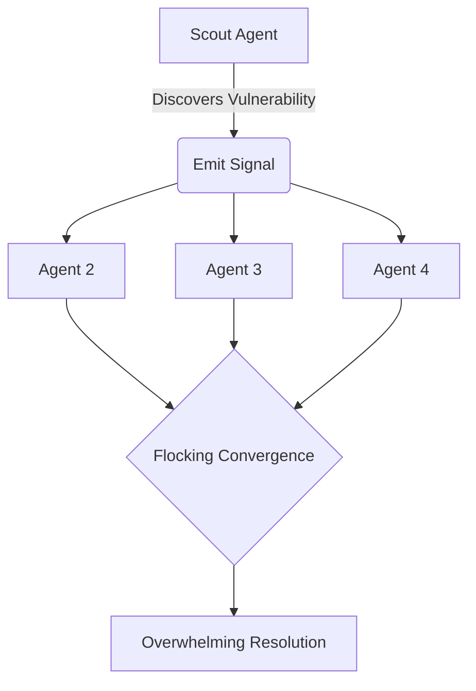

# Sociability and Ecology (Population Dynamics)

Griot is not designed to operate exclusively as a solitary entity. The GenOS orchestrator is fully capable of deploying, coordinating, and managing massive, distributed swarms of autonomous agents, creating complex ecological dynamics within a given software environment.

For understanding how individual agents adapt within these swarms, refer to [Epigenetic Plasticity](./01_griot_epigenetics.md).

## 1. Quorum Sensing

Mimicking the behavior of bacterial colonies, GenOS agents utilize quorum sensing to optimize resource allocation. Before executing a highly resource-intensive operation—such as a massive, repository-wide architectural refactoring—the distributed agents wait until a specific population threshold (Quorum) is achieved. This prevents premature execution and ensures that vast computational resources (tokens and CPU cycles) are not wasted if the collective swarm lacks the "striking force" necessary to complete the task successfully.
* **Primary MCP Tool**: `genos_biomimicry_network_quorum`

## 2. Flocking (Swarm Intelligence)

The system heavily relies on emergent swarm intelligence, primarily through flocking behaviors reminiscent of avian navigation. If a vanguard or "scout" agent identifies a high-value target or a critical structural vulnerability (e.g., an obscured zero-day flaw deep within the API layer), it emits a localized signal. The surrounding agents immediately utilize the Flocking protocol to align their operational vectors, converging their collective computational power onto the discovered locus to resolve the issue with overwhelming speed and precision.
* **Primary MCP Tool**: `genos_biomimicry_flocking_explore`

