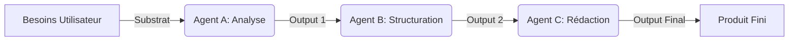
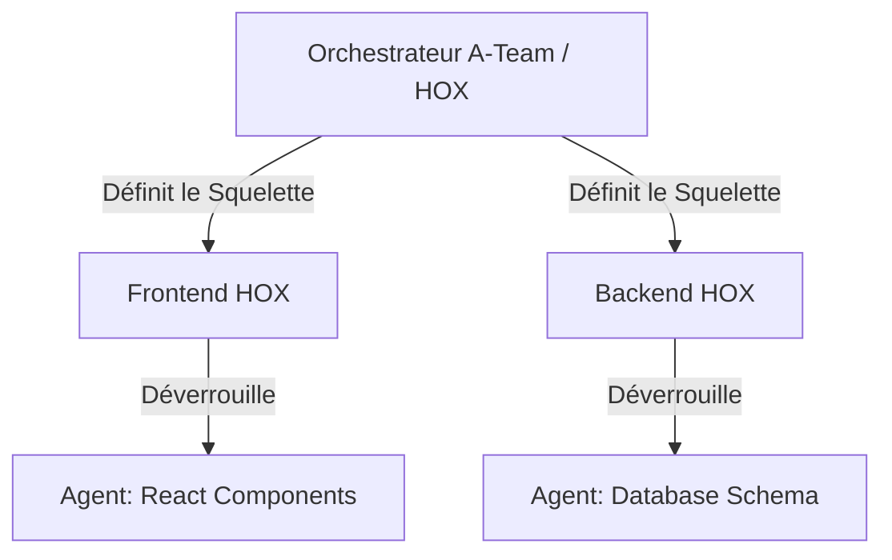
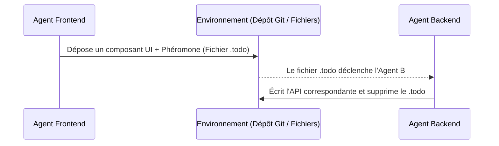

# Biological Prompt Chaining (Séquençage Cognitif)

L'architecture GenOS aborde les limitations des LLMs (épuisement du contexte, "flemme" générative, hallucinations de fatigue) non pas par la force brute, mais par le **Prompt Chaining Biomimétique**. Inspiré de la biologie, ce concept divise les tâches monolithiques en cascades séquentielles.

Ces principes s'appliquent à tous les niveaux : l'Agent individuel, l'Orchestrateur, Griot, et la A-Team.

## 1. Cascades Métaboliques (Enzymatic Chaining)
Dans la nature, la glycolyse transforme le glucose en ATP via une série d'enzymes. Chaque enzyme accomplit une micro-tâche.
Dans GenOS, l'Orchestrateur divise un prompt gigantesque en micro-prompts. La sortie du Modèle A devient l'entrée du Modèle B.

### Schéma (Mermaid)

### Cas d'Utilisation
*   **Griot** : Plutôt que de demander à un modèle 8B d'analyser une erreur et de la corriger, Griot utilise un modèle pour *extraire* la stack trace, et un autre pour *proposer* la correction.

## 2. Gènes HOX & Morphogenèse (Hierarchical Chaining)
Les gènes HOX définissent les grands axes d'un embryon, déverrouillant ensuite les gènes locaux (bras, doigts). 
Dans GenOS, la **A-Team** utilise ce principe pour le développement de projets logiciels complexes. L'Orchestrateur (Gène HOX) définit l'architecture (Tête, Tronc), puis active les sous-agents (Gènes locaux) pour coder les détails.

### Schéma (Mermaid)

### Cas d'Utilisation
*   **A-Team** : L'Orchestrateur crée les profils des membres (HOX global), puis demande à chaque membre de définir ses tâches (Morphogenèse locale).

## 3. Stigmergie (Environmental Chaining)
Les insectes sociaux (fourmis, termites) communiquent via des modifications de l'environnement (phéromones, architecture).
Dans GenOS, les agents ne se parlent pas directement via des API complexes : ils déposent des fichiers d'état, des commentaires "TODO" ou des traces (phéromones) dans le code source ou le `scratch/`.

### Schéma (Mermaid)

### Cas d'Utilisation
*   **Essaim (Swarm)** : Un agent de recherche laisse un fichier `sources.json`. Sa simple présence déclenche automatiquement l'agent rédacteur, sans besoin d'un signal réseau externe.
