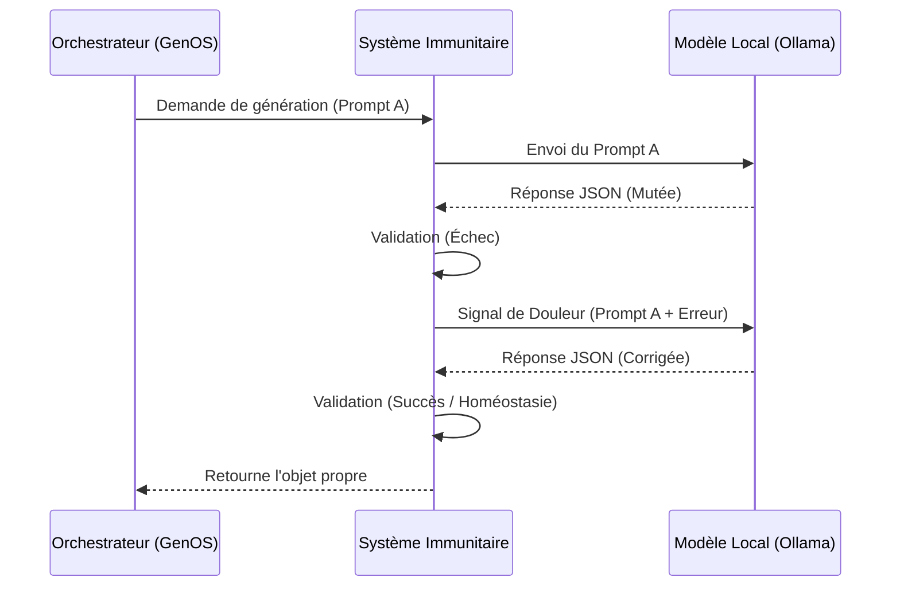

# Cognitive Immune System (Homéostasie & Apoptose)

Le Système Immunitaire Cognitif est un composant central de GenOS, disponible globalement pour Griot, l'Orchestrateur A-Team, et les sous-agents. Son rôle est de prévenir les "mutations sémantiques" des modèles de langage locaux.

## Principes Biologiques

### 1. La Phagocytose (Validation)
Chaque réponse d'un LLM est traitée comme un antigène potentiel. Elle est ingérée par une fonction `validatorFn`. Si le JSON est muté (ex: le modèle a renvoyé un Objet au lieu d'une Chaîne de caractères), le validateur le détecte.

### 2. La Réponse Inflammatoire (Douleur)
Si une mutation est détectée, le système ne crashe pas. Il génère une "inflammation" : il renvoie un signal de douleur au LLM en injectant l'erreur (la trace d'exception) dans un nouveau prompt d'auto-correction. Le LLM "sent" la douleur de son erreur et ajuste son comportement probabiliste.

### 3. L'Apoptose (Mort Cellulaire Programmée)
Si le LLM n'arrive pas à s'auto-corriger après `maxRetries` essais (généralement 3), le processus est considéré comme métastasé. Le système déclenche une apoptose (il tue l'instance de génération et renvoie un signal neutre/vide ou une erreur contrôlée) pour éviter que cette corruption sémantique ne se propage dans le reste de l'application GenOS.

## Schéma d'Architecture (Mermaid)



## Utilisation

Le service est accessible de partout via `backend/src/services/immuneSystem.js`.

```javascript
const { withImmunity } = require('./services/immuneSystem.js');

const validator = (data) => {
    if (typeof data.titre !== 'string') throw new Error("Mutation: le titre doit être une String.");
};

const result = await withImmunity("Génère un titre...", "low", validator, 3, "griot_agent");
```
