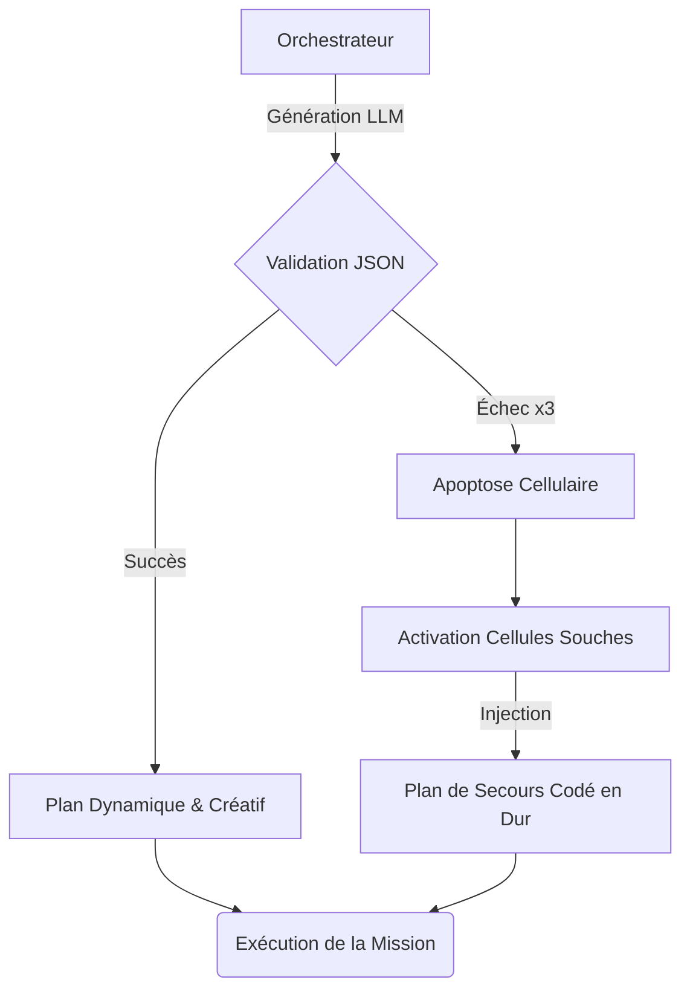
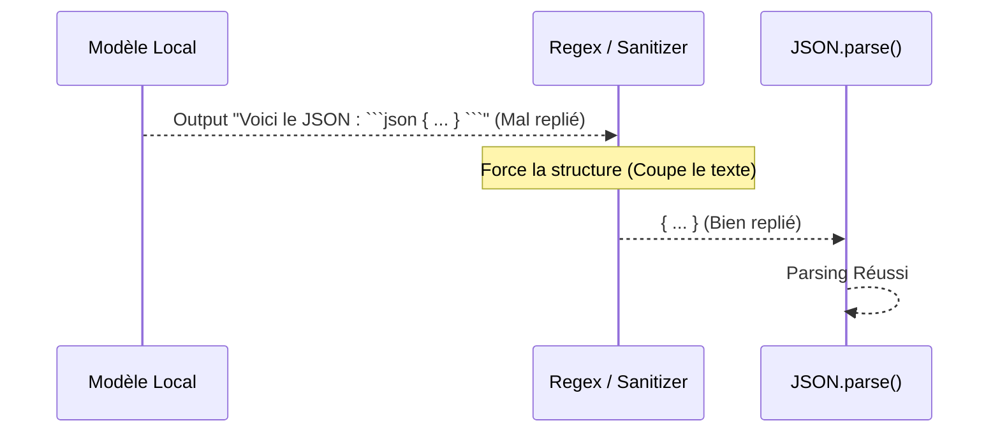

# Résilience Cellulaire & Survie du Système Multi-Agents

Dans un écosystème d'IA basé sur des LLMs locaux, l'incertitude (la stochasticité) est la norme. Les modèles font des erreurs de syntaxe, oublient des contraintes ou épuisent leur contexte. L'architecture **GenOS** ne cherche pas à rendre les LLMs parfaits, mais à rendre le système environnant **résilient** à leurs échecs, en s'inspirant des mécanismes de survie cellulaire.

## 1. Cellules Souches (Stem Cells) : Le Fallback Indifférencié
Lorsqu'un tissu est endommagé, l'organisme utilise des cellules souches (un ADN pur, codé en dur, sans spécificité complexe) pour remplacer l'organe défaillant.
Dans GenOS, si la génération dynamique (neurogenèse) d'un plan complexe par le LLM échoue à plusieurs reprises, le système abandonne la "créativité" et active un plan "codé en dur" pour garantir que la mission vitale se poursuive.

### Schéma (Mermaid)


## 2. Protéines Chaperons (Chaperone Proteins) : Réparation Syntaxique
Dans la nature, si une protéine est mal repliée sous l'effet du stress (chaleur), les protéines chaperons s'y fixent pour forcer son repliement correct en 3D.
Dans GenOS, si un LLM génère un JSON "mal replié" (entouré de balises markdown ` ```json ` ou de texte explicatif), les fonctions de nettoyage (Regex / Sanitizers) agissent comme des protéines chaperons. Elles coupent les excroissances et "replient" la donnée dans une structure JSON valide avant de la parser.

### Schéma (Mermaid)


## 3. Pléiotropie & Redondance (Pleiotropy) : Diversité Cognitive
Les fonctions biologiques vitales sont codées par plusieurs gènes indépendants. Si un gène mute, un autre prend le relais.
Dans GenOS, au lieu de réessayer 3 fois la même requête sur le même modèle local (qui risque de s'entêter dans son hallucination), le Routeur Cognitif implémente la pléiotropie en changeant de modèle (ex: basculer de Llama à Qwen) lors des tentatives de réparation.

### Schéma (Mermaid)


## 4. Régénération Épimorphique (Epimorphic Regeneration)
À l'instar d'une salamandre capable de faire repousser un membre amputé grâce à la "mémoire" de la forme contenue dans son blastème, GenOS utilise l'historique Git comme ADN structurel. Si un sous-agent autonome devient fou et supprime un fichier critique du dépôt, l'Agent Observateur (Télémétrie) détecte l'amputation et exécute un `git restore` immédiat.
