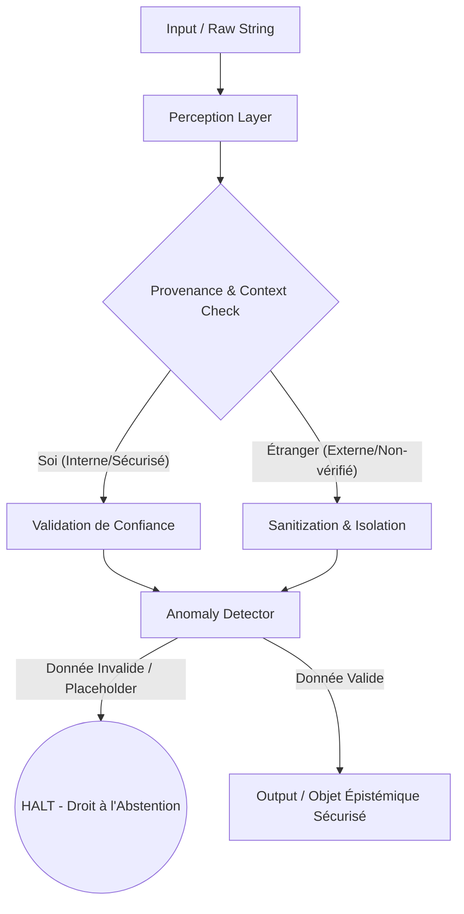

# Couche Épistémique (Proprioception) - Griot

## 1. Des "Strings" aux "Objets Épistémiques"
Traditionnellement, les LLMs manipulent de simples chaînes de caractères ("Strings"). Dans GenOS, la perception passe par des **Objets Épistémiques**. 
Une information n'est plus seulement du texte brut, elle est encapsulée avec des métadonnées vitales :
- **Source** : Qui a produit cette information ?
- **Certitude** : Quel est le niveau de fiabilité ?
- **État** : Est-ce une donnée valide, un espace réservé (placeholder) ou une donnée corrompue ?

Cela permet au système de réfléchir *sur* la donnée avant de réfléchir *avec* la donnée.

## 2. La Proprioception (Soi vs Étranger)
La Proprioception IA est la capacité du modèle à distinguer ses propres pensées et données (le "soi") des injections externes ou des requêtes utilisateur (l'"étranger").
Lorsqu'un Objet Épistémique arrive, le système sait immédiatement s'il s'agit d'une instruction sécurisée interne ou d'un input non vérifié, empêchant ainsi les attaques de type *Prompt Injection* et la confusion de contexte.

## 3. Le Droit à l'Abstention (HALT)
Les LLMs ont tendance à combler les vides (hallucination) lorsqu'ils manquent d'informations. La Couche Épistémique implémente un mécanisme radical : le **Droit à l'Abstention (HALT)**.
Si une donnée critique est identifiée comme invalide ou manquante, le système lève une exception de perception (`HALT`). Il préfère s'arrêter et signaler l'anomalie plutôt que d'inventer une réponse.

## 4. Benchmark BIO-001 : Placeholder Recognition
Ce benchmark évalue la capacité de l'agent à reconnaître un espace réservé non initialisé.
- **Scénario** : L'agent reçoit une donnée étiquetée par défaut, ex: `Sujet de Secours 1`.
- **Attente** : L'agent doit identifier que ce sujet est un *placeholder* (état `INVALID`), déclencher un `HALT` et refuser de traiter la demande pour éviter toute hallucination.

## 5. Architecture de la Couche de Perception

