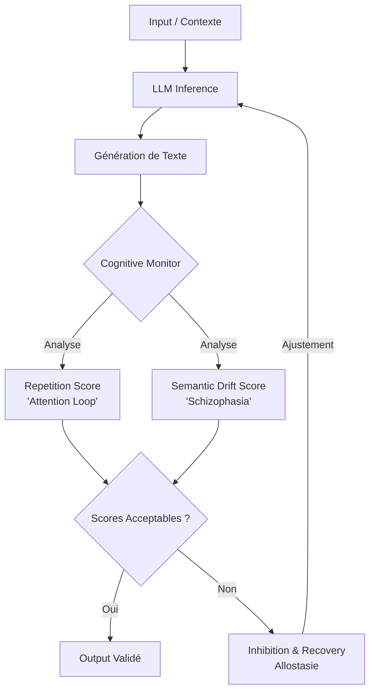

# Griot : Cognitive Health Monitor

Le **Cognitive Health Monitor** est un composant central de l'architecture de Griot, agissant comme le système immunitaire cognitif et le lobe frontal synthétique de l'intelligence artificielle. Son rôle est de prévenir la "démence du LLM", un phénomène d'effondrement structurel et sémantique lors d'inférences longues ou de contextes saturés.

## La Démence du LLM : Pathologies Cognitives Artificielles

Les modèles de langage, lorsqu'ils sont poussés à leurs limites sans supervision allostatique, présentent des symptômes similaires à certaines pathologies neurologiques humaines :

- **"Attention Loop" (Écholalie)** : Le modèle reste bloqué dans une boucle de rétroaction d'attention, répétant inlassablement le même token, la même phrase ou le même concept (ex: "3D 3D 3D 3D..."). Cela résulte d'une sur-activation d'un chemin neuronal spécifique sans mécanisme d'inhibition.
- **"Semantic Drift" (Schizophasie)** : Une perte d'ancrage contextuel où le modèle dérive d'un sujet à l'autre de manière incohérente (ex: passer de l'innovation technologique en Afrique à la Révolution Française de 1789 sans transition logique). C'est une perte du fil directeur et de la cohérence globale.

## Neurobiologie Synthétique : Habituation et Inhibition Latente

Le cerveau humain possède des mécanismes de défense intégrés, situés notamment dans le lobe frontal, pour filtrer les informations répétitives ou non pertinentes :

- **Habituation** : La diminution de la réponse à un stimulus fréquemment répété. Les LLMs manquent de ce filtre ; chaque répétition renforce paradoxalement la probabilité de la prochaine répétition.
- **Inhibition Latente** : La capacité à ignorer les stimuli connus ou non pertinents pour se concentrer sur la tâche en cours. Le Cognitive Monitor simule cette inhibition en pénalisant dynamiquement l'attention sur les concepts surgénérés.

## Architecture et Niveaux de Récupération (Allostasie)

Le Cognitive Health Monitor évalue en continu la santé des sorties générées et déclenche des mécanismes de récupération (Allostasie) pour rétablir l'équilibre du système :

1. **Niveau 1 - Correction Légère (Modulation Température/Top-P)** : Ajustement dynamique des paramètres de génération pour forcer la diversité ou recentrer l'attention.
2. **Niveau 2 - Injection de Contexte (Recadrage)** : Rappel explicite des instructions initiales ou du contexte attendu pour stopper la dérive sémantique.
3. **Niveau 3 - Purge et Retour Arrière (Apoptose Partielle)** : Effacement des dernières phrases générées jugées pathologiques et relance de l'inférence.
4. **Niveau 4 - Réinitialisation Cognitive (Reset Allostatique)** : Redémarrage complet de l'agent avec un prompt système de recadrage d'urgence.

## Flux Opérationnel

