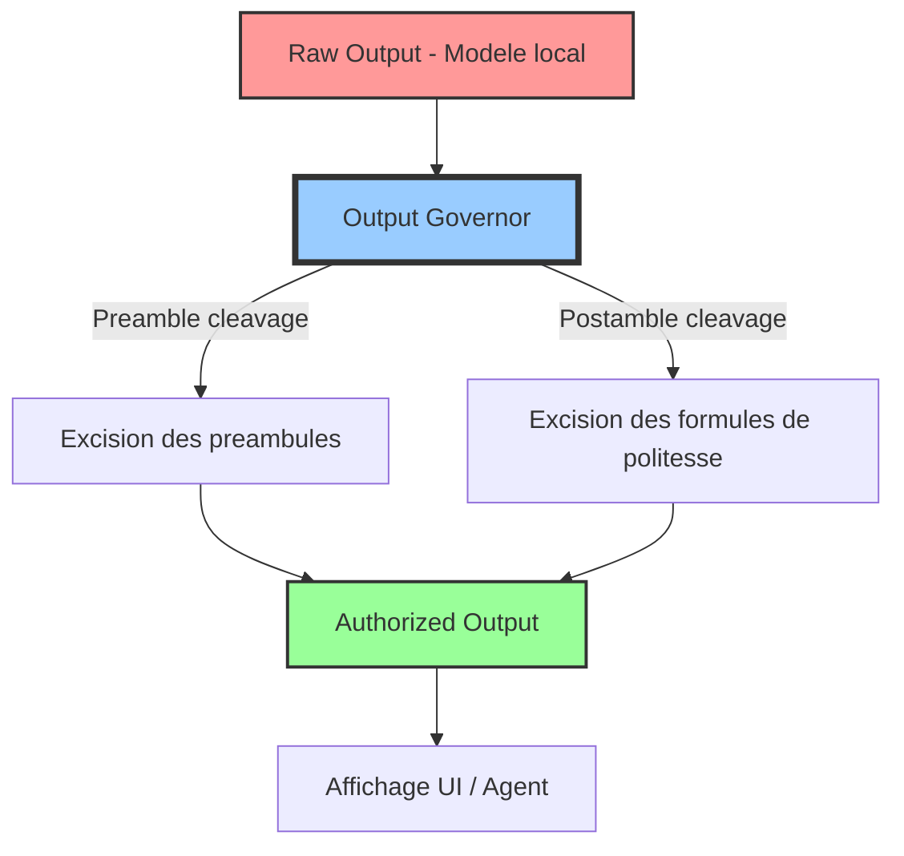

# Manifeste : Griot Output Governor

Ce manifeste définit le rôle de l'Output Governor au sein de l'architecture Griot de GenOS, agissant comme le filtre ultime entre la cognition brute des modèles et l'expression autorisée.

## Cognition vs Expression

Il est essentiel de séparer conceptuellement ce que l'IA *pense* (Cognition) de ce qu'elle a le droit de *dire* (Expression).

- **Cognition (Ce que l'IA pense) :** Le processus interne, la chaîne de pensée, les déductions logiques. Ce flux est souvent bruyant, itératif et contient des métadonnées contextuelles.
- **Expression (Ce qu'elle a le droit de dire) :** La sortie finale formatée, stricte et utilitaire, purgée de tout bruit conversationnel.

## L'Incontinence Conversationnelle et le Lobe Frontal

Les modèles de langage, même locaux, souffrent souvent d'**Incontinence Conversationnelle** (verbosity, séquelles du RLHF) : ils s'excusent, ajoutent des préambules ("Voici le texte..."), des conclusions polies ("N'hésitez pas...").

L'**Output Governor** agit comme le **Lobe Frontal** (inhibition des comportements inadaptés) ou comme une **Exonucléase** (clivage des extrémités indésirables d'une chaîne). Il repère et ampute systématiquement ces métadonnées conversationnelles pour ne conserver que la charge utile.

## Architecture du Flux d'Expression

