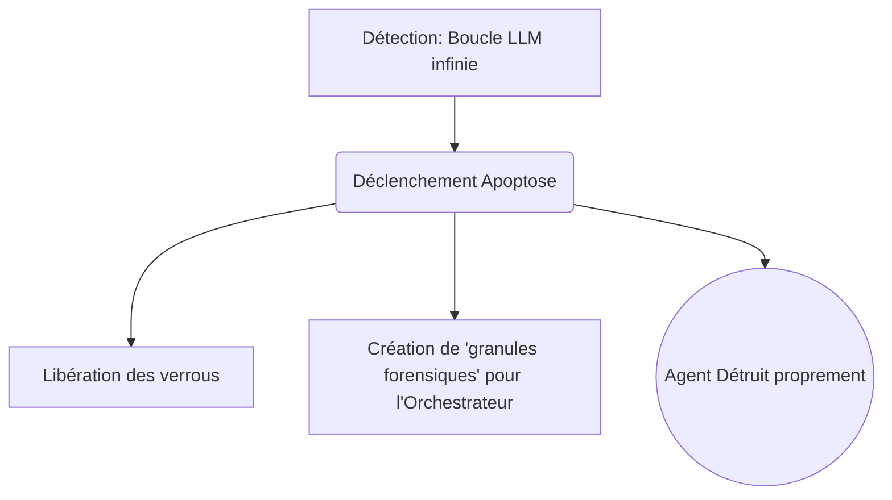

# 13. MORT CELLULAIRE & NETTOYAGE

L'élimination des agents inutiles, buggés ou dangereux est aussi importante que leur création. GenOS est conçu pour que la mort d'un agent soit un processus utile au système.

---

## 13.1 Apoptose (Mort propre)

### Ce que ça apporte à l'agent
Contrairement à la nécrose (un programme qui crash sauvagement en laissant des verrous et des fichiers corrompus), l'Apoptose (	rigger_apoptosis) est un suicide cellulaire organisé. 
Si un agent détecte une boucle infinie, une divergence sémantique, ou subit un dépassement de capacité virale, il s'auto-détruit proprement. 
Cela apporte **l'isolation des pannes (Containment)**. Le théorème 1 & 2 de GenOS prouve que l'apoptose borne la cascade d'erreurs à la longueur 1. Une erreur ne se propage pas.

### Schéma Conceptuel

---

## 13.2 Phagocytose et Autophagie (Nettoyage)

### Ce que ça apporte à l'agent
- **Phagocytose (Macrophage / Dead Letter Queue)** : Le système possède un Cleaner qui agit comme un macrophage biologique. Il ingère la *Dead Letter Queue* (DLQ), "digérant" les messages asynchrones orphelins ou corrompus laissés par des agents morts.
- **Autophagie** : C'est le Garbage Collector (GC) de GenOS (Autophagy.cleanup). Il nettoie les espaces de travail (worktrees) obsolètes qui encombrent le disque dur.

### Exemple Comparatif : Un agent s'emballe et écrit du code absurde en boucle
| Type d'Agent | Fin de vie | Impact Système |
|---|---|---|
| **Agent Simple / Script classique** | Crash de la mémoire (OOM) ou tué par l'humain. | Fichiers à moitié écrits, corruption du repo, perte de trace. |
| **Worker GenOS** | Le Nocicepteur détecte l'erreur critique. L'agent déclenche son Apoptose. | Il annule son dernier commit (rollback), écrit une autopsie dans le système télémétrique et meurt proprement. |
| **Orchestrateur GenOS** | Reçoit l'autopsie, déploie un Macrophage pour nettoyer la file de messages associée, puis lance un nouveau Worker avec une mutation pour éviter ce crash. | Tolérance aux pannes à l'échelle industrielle. |
