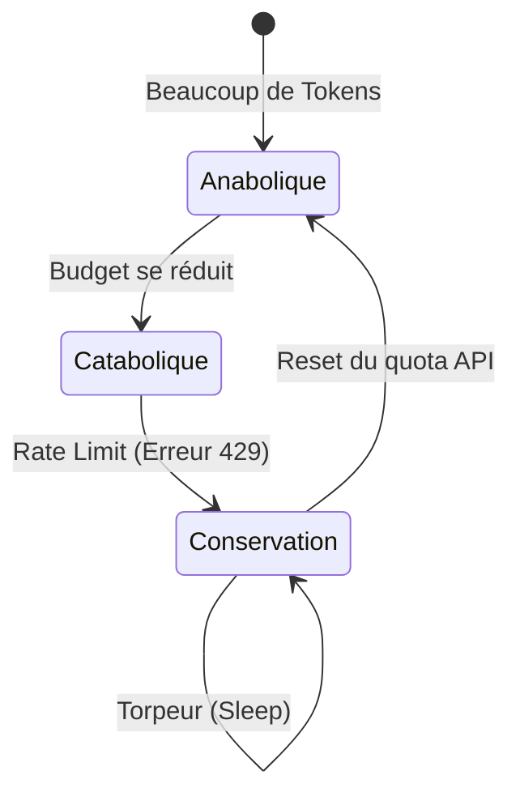

# 14. HOMÉOSTASIE & MÉTABOLISME

Comment GenOS maintient un équilibre interne stable (taux de requêtes API, charge cognitive) malgré des perturbations extérieures constantes.

---

## 14.1 AMPK (Senseur Énergétique) et Torpeur

### Ce que ça apporte à l'agent
Inspiré de l'enzyme biologique AMPK (senseur du ratio ATP/AMP cellulaire). Dans GenOS (mpk.rs), c'est un métrique mesurant la "charge" de l'agent.
Il définit 3 modes :
- **Anabolique** : Ressources abondantes. L'agent explore profondément (Monte Carlo Tree Search très profond).
- **Catabolique** : Ressources limitées. L'agent est plus direct et économe.
- **Conservation (Torpeur métabolique)** : Limite atteinte (ex: API rate-limit 429). L'agent entre en Torpor (backoff exponentiel) + élagage de mémoire.

Cela apporte la **gestion parfaite du Rate-Limiting et de la facturation**. L'agent "sent" sa fatigue financière et ralentit de lui-même sans avoir besoin d'un script externe de throttling.

### Schéma Conceptuel

---

## 14.2 Scaling homéostatique de Turrigiano

### Ce que ça apporte à l'agent
Dans un réseau de neurones biologique, si une synapse est trop utilisée, elle accapare tout et provoque des crises (épilepsie). Turrigiano a découvert le "scaling multiplicatif" qui normalise les poids synaptiques globalement.
Dans GenOS (prune_and_scale()), cela s'applique au graphe de mémoire de l'agent. Si un concept est appelé en permanence, ses "poids" sont normalisés vers une cible, et les liens faibles sont coupés.
Cela apporte la **prévention du collapse d'attention**. Ça empêche l'agent de devenir "obsédé" par un seul fichier ou un seul concept de la base de code, garantissant qu'il reste capable de considérer d'autres solutions.

### Exemple Comparatif : Faire face à l'épuisement du quota API (Erreur 429)
| Type d'Agent | Réaction | Résultat |
|---|---|---|
| **Agent Simple** | Spam l'API en boucle ("Je réessaie"). | Ban définitif de l'IP par le fournisseur d'API. |
| **Agent Expert** | Un wrapper externe impose un 	ime.sleep(60). | L'agent reste bloqué et fige le système, son prompt actif occupe la RAM pour rien. |
| **Worker GenOS** | Le senseur AMPK détecte la chute d'énergie. Il entre en mode Conservation (Torpeur). | Il élague sa mémoire de travail (libère la RAM), stoppe toute réflexion coûteuse, et planifie son propre réveil (backoff). |
| **Orchestrateur GenOS** | Observe le Worker en torpeur. | Détourne le trafic vers un autre Worker utilisant un autre modèle/fournisseur d'API (fallback). |
