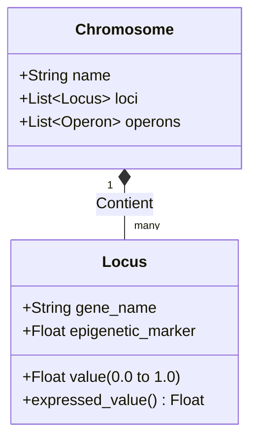

# 1. GÉNÉTIQUE FONDAMENTALE

Ce document explique les concepts de génétique fondamentale intégrés dans l'architecture GenOS, leur utilité, et en quoi ils confèrent un avantage décisif par rapport aux approches d'IA classiques.

---

## 1.1 Génome / Génotype / Phénotype

### Ce que ça apporte à l'agent
Dans GenOS, un agent n'est pas qu'un simple prompt ou un script Python. Il possède une "couche héritée" (son **génome/génotype**) qui définit son identité, ses drives cognitifs (curiosité, prudence, etc.), et ses politiques d'accès aux outils et à la mémoire. Le **phénotype** est l'expression de ce génome face à un environnement donné (une tâche spécifique, un contexte). 
Cela apporte une **séparation stricte entre l'état d'un agent et son identité fondamentale**. Un agent peut être "snapshoté", "forké" ou "rejoué" de manière totalement déterministe, garantissant une reproductibilité et une traçabilité totale (aucune modification du comportement de l'agent ne se fait sans mutation enregistrée).

### Schéma Conceptuel
```mermaid
flowchart TD
    G[Génotype / Génome\n(Drives, Politiques, ADN numérique)] -->|Expression| P[Phénotype\n(Comportement de l'agent)]
    E[Environnement\n(Tâche, Contexte, Contraintes)] -->|Influence| P
    P -->|Résultats / Actions| R[Performance / Survie]
    
    subgraph GenOS
    G
    P
    end
```

### Cas d'usage
- **Débogage temporel et Auditabilité** : Si un agent prend une mauvaise décision critique, vous pouvez rejouer la capsule exacte (même génome + même environnement) pour comprendre *pourquoi*.
- **Contrôle d'apprentissage** : Empêche un agent de "dériver" silencieusement (catastrophic forgetting ou corruption de prompt) car son apprentissage doit être formellement inscrit dans son génome via une mutation contrôlée.

### Différence par rapport aux agents classiques et concurrents
- **Agents actuels / Concurrents** : L'état et l'identité sont mélangés dans un contexte conversationnel (prompt + historique de chat). Si le contexte devient trop grand, l'agent perd son identité. Il n'y a pas de "code source de la personnalité" traçable.
- **GenOS** : Traite l'agent comme un organisme avec un ADN inaltérable à l'exécution, offrant des garanties de sécurité et d'auditabilité (norme ADR-0008).

### Exemple Comparatif : Faire face à une tâche complexe (ex: Refactoring d'un composant critique)
| Type d'Agent | Réaction & Comportement | Résultat |
|---|---|---|
| **Agent Simple (ex: ChatGPT brut)** | Essaie de tout faire d'un coup en se basant sur le prompt initial. | Oublie la moitié des contraintes, génère du code cassé. |
| **Agent Expert (Bon prompt)** | Suit des instructions détaillées étape par étape. | Peut réussir, mais si on lui demande de recommencer 1 mois plus tard, le comportement varie. Pas de traçabilité. |
| **Worker GenOS** | Charge son génome spécifique de "Code Reviewer Prudent". Son phénotype s'exprime par une tolérance au risque faible. | Refuse les modifications non testées. Comportement 100% reproductible si on reload la même capsule génomique. |
| **Orchestrateur GenOS** | Lit le génome des workers disponibles et affecte le worker avec le génome le plus adapté (tolérance au risque, expertise) à la tâche. | La tâche est gérée de manière industrielle et prédictible. |

---

## 1.2 Gène / Locus / Chromosome

### Ce que ça apporte à l'agent
L'ADN de GenOS est structuré. Un **Chromosome** regroupe des unités logiques, composées de **Loci** (pluriel de locus). Chaque locus contient un gène, caractérisé par un nom, une valeur continue (entre 0 et 1), et un marqueur épigénétique.
Cette structure permet une **quantification précise** des traits cognitifs d'un agent. Au lieu de dire "Sois créatif" dans un prompt (ce qui est subjectif pour le LLM), GenOS configure un locus `exploration_drive = 0.85`.

### Schéma Conceptuel


### Cas d'usage
- **Tuning fin (Fine-tuning continu)** : Ajuster mathématiquement le comportement d'un agent (ex: baisser le gène `risk_tolerance` de 0.1) au lieu d'ajouter des phrases approximatives dans un system prompt.
- **Diversité contrôlée** : Créer un essaim d'agents ayant des valeurs de loci légèrement différentes pour s'assurer d'explorer toutes les solutions à un problème complexe.

### Différence par rapport aux agents classiques et concurrents
- **Concurrents** : La personnalité et les capacités sont textuelles. Pour changer un agent, on modifie du texte.
- **GenOS** : Modélisation vectorielle/quantitative (haploïde) des traits. Cela permet des opérations mathématiques sur les agents (moyenne, distance génétique).

### Exemple Comparatif : Équilibrer Créativité vs Rigueur
| Type d'Agent | Réglage | Mécanique |
|---|---|---|
| **Agent Simple** | "Sois créatif." | Le LLM hallucine souvent. |
| **Agent Expert** | Ajustement du paramètre `temperature` de l'API. | S'applique globalement à tous les mots générés, perdant en rigueur logique globale. |
| **Worker GenOS** | Locus `exploration_drive = 0.8` ; Locus `syntax_strictness = 0.9`. | L'agent cherche des solutions novatrices tout en maintenant une structure de code parfaite, car ses drives modulent son comportement interne (prompt dynamique et politiques d'outils). |
| **Orchestrateur GenOS** | Utilise les Loci pour calculer la distance génétique entre deux agents. | Évite d'assigner deux agents clones sur un problème insoluble, cherchant un agent génétiquement éloigné pour un regard neuf. |

---

## 1.3 Expression Génique

### Ce que ça apporte à l'agent
Dans la biologie, posséder un gène ne suffit pas, il faut qu'il s'exprime. Dans GenOS, l'**Expression Génique** (la valeur réelle utilisée au moment de l'action) est le résultat de la valeur de base du gène modulée par l'environnement et l'expérience (marqueurs épigénétiques).
Cela permet à l'agent de **s'adapter dynamiquement sans altérer son code source**.

### Schéma Conceptuel
```mermaid
flowchart LR
    V[Valeur de base du Gène\n(ex: 0.5)] --> Calc(Calcul d'Expression)
    M[Marqueur Épigénétique\n(Stress, Expérience récente)] --> Calc
    Calc --> E[Valeur Exprimée\n(ex: 0.75)]
    E --> Action[Comportement de l'Agent]
```

### Cas d'usage
- **Adaptation au stress** : Si l'agent enchaîne les erreurs, un marqueur épigénétique modifie l'expression de son gène de "prudence", le rendant soudainement très conservateur sans avoir muté définitivement.
- **Immunité et Infection** : L'expression génique permet de calculer la susceptibilité à un "virus" (un mauvais prompt injecté). Si l'expression d'un gène d'analyse critique est faible, l'agent est plus vulnérable.

### Différence par rapport aux agents classiques et concurrents
- **Concurrents** : L'agent est statique. Face à l'échec répétitif, un script classique fait une boucle infinie ou crash.
- **GenOS** : L'agent a une plasticité intrinsèque. Son expression change en temps réel (via `Locus::expressed_value()`), lui permettant de réagir organiquement aux difficultés.

### Exemple Comparatif : Réaction face à une API dépréciée qui renvoie des erreurs 404
| Type d'Agent | Échec 1 | Échec 3 | Résultat Final |
|---|---|---|---|
| **Agent Simple** | Essaie l'API. | Répète la même requête en boucle. | Crash / Timeout. |
| **Agent Expert** | Essaie l'API. | Un script externe compte les échecs et stop l'agent. | Arrêt brutal, intervention humaine requise. |
| **Worker GenOS** | Essaie l'API (Gène de persévérance exprimé à 0.8). | Le stress augmente le marqueur épigénétique. L'expression de la persévérance chute à 0.2, l'exploration monte à 0.9. | L'agent abandonne l'API et se met à chercher une méthode alternative sur internet. |
| **Orchestrateur GenOS** | Observe le changement d'expression génique du Worker. | Déduit que la tâche est bloquée. | Isole le Worker, déploie un agent avec un locus "Investigation Infrastructure" très élevé. |
