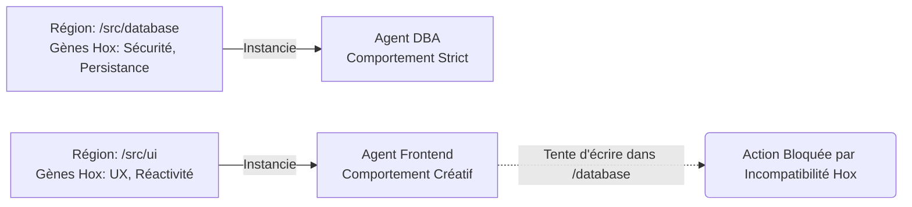

# 28. GÈNES HOX (Gènes Architectes)

Les gènes Hox (ou gènes homéotiques) définissent l'axe antéro-postérieur et les segments du corps d'un embryon (où mettre la tête, où mettre les jambes). GenOS s'en inspire pour le placement des composants logiciels.

---

## 28.1 Structuration de l'Espace Projet

### Ce que ça apporte à l'agent
Dans un repo, les "Gènes Hox" de GenOS définissent les "régions" de la base de code (ex: la région src/api est différente de src/components). 
Si un agent mute ou bourgeonne dans la région src/api, les gènes Hox lui imposent un phénotype "Backend" (rigueur, sécurité). S'il est dans src/components, les gènes Hox lui imposent un phénotype "Frontend" (UI, accessibilité).
Cela apporte une **conscience topographique**. Les agents ne se perdent jamais dans le projet ; leur comportement est dicté par l'endroit "géographique" où ils se trouvent.

### Schéma Conceptuel

### Cas d'usage
- **Prévention du "Code Spaghetti"** : Un agent travaillant sur l'UI ne peut pas accidentellement insérer une connexion SQL directe dans un composant React, car les "Gènes Hox" de cette zone interdisent l'expression des gènes d'accès aux bases de données.

