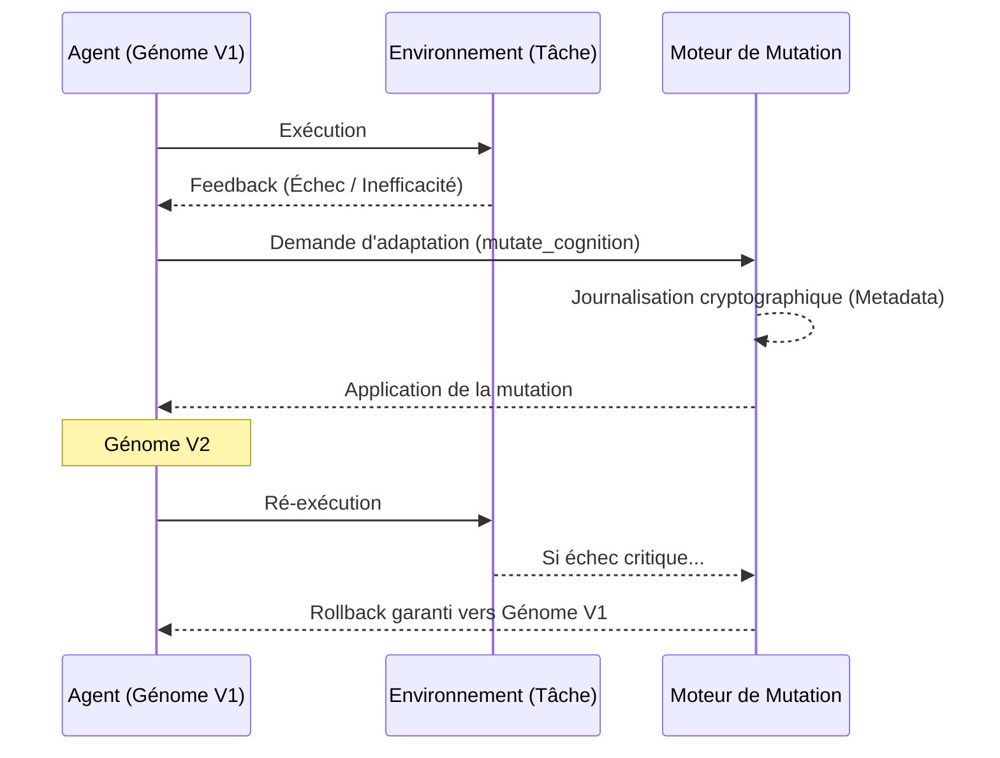
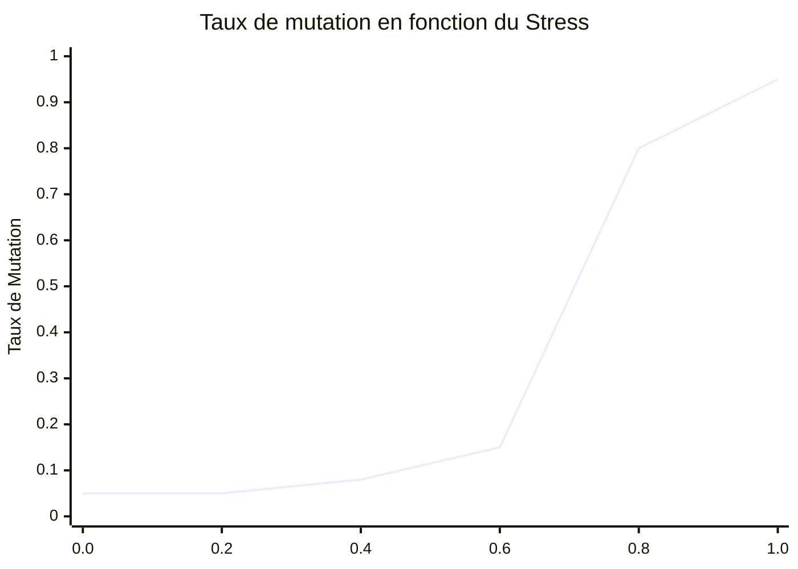

# 2. MUTATION

Ce document détaille les concepts de mutation intégrés dans GenOS, permettant aux agents d'évoluer de manière sécurisée et contrôlée.

---

## 2.1 Mutation Traçable

### Ce que ça apporte à l'agent
Dans GenOS, l'apprentissage ne se fait pas de manière implicite, cachée dans les poids d'un réseau ou dans la mémoire d'un prompt infini. Une modification du comportement cognitif passe par une **mutation de ses drives**. Cette mutation est accompagnée d'un journal cryptographique (`GenomeMutationMetadata`).
Cela apporte **réversibilité, sécurité et explicabilité**. Si une mutation s'avère néfaste (baisse de performance), le système peut l'annuler (rollback) avec une garantie mathématique.

### Schéma Conceptuel


### Cas d'usage
- **Survie et Optimisation** : Un agent s'adapte à un nouveau framework en ajustant ses drives, mais garde la trace exacte du changement.
- **Compliance / Audit** : Dans des environnements critiques, pouvoir prouver pourquoi et quand un agent IA a changé sa méthode de travail.

### Différence par rapport aux agents classiques et concurrents
- **Concurrents** : L'adaptation se fait souvent par RAG (Retrieval-Augmented Generation) où l'agent "lit" ses erreurs passées. C'est lent, coûteux en tokens, et sujet aux hallucinations. L'état global dérive.
- **GenOS** : L'adaptation est structurelle (le gène change) et traçable (commit style git). Le coût en inférence reste constant (O(1)).

### Exemple Comparatif : Adaptation à un nouveau linter très strict
| Type d'Agent | Confrontation | Résolution |
|---|---|---|
| **Agent Simple** | Le linter rejette le code. | Bloqué ou tourne en rond. |
| **Agent Expert** | Le RAG injecte les règles du linter dans le prompt. | Le prompt gonfle démesurément, la latence augmente, l'agent devient confus par trop d'instructions. |
| **Worker GenOS** | Détecte le stress du rejet. Demande une mutation `syntax_strictness` +0.2. | La mutation est loggée. Le comportement change structurellement sans surcoût de prompt. Si ça casse autre chose, rollback O(1). |
| **Orchestrateur GenOS** | Valide la mutation traçable. | Peut propager cette mutation réussie (ce nouveau génome) à d'autres workers affrontant le même linter. |

---

## 2.2 Point Mutation & Frameshift (Bursts lytiques)

### Ce que ça apporte à l'agent
Issue de la dynamique virale, cette mécanique s'active quand l'agent est bloqué dans un "minimum local" (une impasse de raisonnement). Sous stress extrême (stress > 0.85), GenOS déclenche un "burst lytique" qui génère des variations violentes (mutations ponctuelles ou décalage de cadre - *frameshift*).
Cela apporte une **capacité d'échappement brutale face aux hallucinations ou boucles de raisonnement**, en forçant l'agent à réordonnancer ses contraintes ou à substituer des éléments de son prompt par des synonymes.

### Schéma Conceptuel
```mermaid
flowchart LR
    S[État Bloqué\n(Stress > 0.85)] --> B{Burst Lytique\nBurstOperon}
    B -->|Point Mutation| M1[Substitution de synonymes\ndans le prompt]
    B -->|FrameShift| M2[Réordonnancement\ndes contraintes]
    B -->|Heuristic Inversion| M3[Inversion des\nhypothèses de base]
    M1 --> Explor[Échappement du minimum local]
    M2 --> Explor
    M3 --> Explor
```

### Cas d'usage
- **Déblocage cognitif** : Un agent est persuadé (à tort) qu'une librairie n'existe pas et refuse d'avancer. Le *frameshift* brouille son contexte immédiat, forçant un "reset" de sa logique sans perdre son but global.

### Différence par rapport aux agents classiques et concurrents
- **Concurrents** : Soit l'agent boucle (le fameux "Je m'excuse, vous avez raison... [répète l'erreur]"), soit l'utilisateur doit réécrire le prompt manuellement ("Oublie tout ce que j'ai dit et...").
- **GenOS** : Automatise la destruction créatrice du contexte de l'agent pour briser les certitudes algorithmiques de bas niveau.

### Exemple Comparatif : Coincé dans une erreur de syntaxe persistante
| Type d'Agent | Situation de blocage | Résultat |
|---|---|---|
| **Agent Simple** | S'excuse en boucle et propose le même code faux. | Échec total. |
| **Agent Expert** | "Clear context" forcé par l'humain. | Repart de zéro, perdant le fil du travail utile déjà accompli. |
| **Worker GenOS** | Le stress monte en flèche. Déclenche un Burst Lytique. | Subit un *ContextScrambling* ou un *FrameShift* : l'ordre des erreurs passées est mélangé, cassant le biais d'attention du LLM. Il trouve la solution. |
| **Orchestrateur GenOS** | Observe le Worker en burst lytique. | Garde les autres workers à distance pour éviter la contagion d'erreurs, puis récupère le résultat une fois l'agent stabilisé. |

---

## 2.3 Réponse SOS Bactérienne (Error-prone mutator)

### Ce que ça apporte à l'agent
Inspirée du système bactérien SOS de réparation d'urgence de l'ADN. Lorsque l'agent fait face à un environnement hostile ou à un taux d'échec critique (seuil de stress franchi), GenOS multiplie drastiquement son taux de mutation normal. 
Cela apporte une **exploration agressive et désespérée**. C'est le principe du "quitte ou double" algorithmique : plutôt que de mourir à petit feu, l'agent prend d'énormes risques cognitifs pour trouver une issue de secours.

*(Note : Actuellement dans GenOS, le multiplicateur est symbolique et non branché sur le vrai moteur de mutation, mais le concept de seuil déclencheur existe via `evaluate_stress_and_mutate`).*

### Schéma Conceptuel


### Cas d'usage
- **Survie en environnement radicalement modifié** : L'API avec laquelle l'agent interagissait change totalement de paradigme (ex: passage de REST à GraphQL). Les mutations douces ne suffisent pas, l'agent déclenche la réponse SOS pour restructurer violemment ses drives de communication.

### Différence par rapport aux concurrents
- **Concurrents** : Les paramètres comme la *température* sont fixes ou gérés par l'utilisateur.
- **GenOS** : Métabolisme de crise autonome. L'agent sent sa propre "mort" algorithmique et déclenche des mécanismes de survie.

---

## 2.4 Hypermutation Somatique

### Ce que ça apporte à l'agent
Inspirée par la façon dont le système immunitaire affine les anticorps. GenOS booste la température d'échantillonnage du LLM en fonction du stress ($\tau(t) = \tau_0 (1 + \alpha \cdot Stress)$, plafonné à 1.25), créant une "fièvre computationnelle".
Pour éviter que l'agent ne divague totalement, une **garde de dérive (Drift Guard)** (basée sur la distance de Levenshtein $\le 0.35$) surveille les outputs au niveau du backend. 
Cela apporte une **créativité exacerbée temporaire et sous haute sécurité**. L'agent génère des solutions folles, mais le système rejette celles qui s'éloignent trop de la syntaxe ou du but initial.

### Schéma Conceptuel
```mermaid
flowchart TD
    Stress[Augmentation du Stress] --> Temp[Boost Température LLM (Fièvre)]
    Temp --> Gen[Génération de solutions créatives / folles]
    Gen --> Guard{Drift Guard\n(Levenshtein <= 0.35)}
    Guard -->|Accepté| Output[Solution Novatrice validée]
    Guard -->|Rejeté| Drop[Solution détruite, évite la folie]
```

### Cas d'usage
- **Résolution de bugs absurdes** (Heisenbugs) : Quand la logique pure échoue, l'hypermutation permet de tester des approches non-conventionnelles tout en garantissant que le code produit reste syntaxiquement valide (grâce au Drift Guard).

### Différence par rapport aux concurrents
- **Concurrents** : Si on augmente la température d'un LLM, il finit par halluciner du texte absurde ou du code invalide.
- **GenOS** : Couple l'augmentation de la variance cognitive (température) avec un anticorps mathématique (Drift Guard). La folie est contenue et canalisée vers la productivité.

### Exemple Comparatif : Bug complexe et inexplicable
| Type d'Agent | Action | Résultat |
|---|---|---|
| **Agent Simple** | Tourne en rond avec Temp=0.2. | Ne trouve jamais. |
| **Agent Expert** | L'utilisateur monte manuellement Temp à 1.0. | L'agent propose des solutions mais casse la syntaxe et hallucine des fonctions. |
| **Worker GenOS** | Le backend déclenche l'hypermutation somatique. Température monte dynamiquement. | Génère des solutions extravagantes. Le Drift Guard backend rejette les dérives sémantiques pures. L'agent trouve le "hack" génial qui résout le bug. |
| **Orchestrateur GenOS** | Surveille le Drift. | Si la fièvre dure trop longtemps sans succès, il met fin au processus pour économiser les ressources et déclenche une autopsie. |
