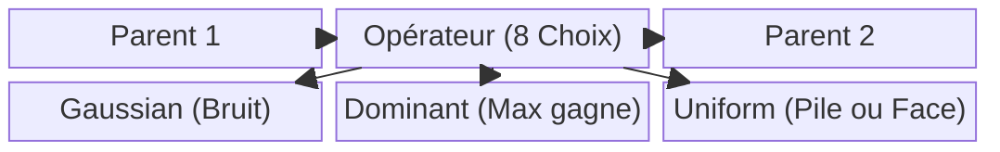

# 3. RECOMBINAISON & REPRODUCTION

Ce document explore comment les agents GenOS se reproduisent, combinent leurs traits et forment de nouvelles lignées pour résoudre des problèmes complexes collectivement.

---

## 3.1 Crossover / Recombinaison Homologue

### Ce que ça apporte à l'agent
La recombinaison homologue permet de créer un nouvel agent (enfant) en mélangeant l'ADN de deux agents performants (parents). Dans GenOS, ce croisement se fait avec un générateur pseudo-aléatoire déterministe (basé sur le hash des parents), garantissant que le croisement de l'Agent A et de l'Agent B donnera toujours l'Enfant C.
Cela apporte **l'hérédité des meilleures pratiques**. Si un agent est excellent en sécurité et un autre en optimisation algorithmique, leur croisement a une chance de produire un agent performant dans les deux domaines.

### Schéma Conceptuel
```mermaid
flowchart TD
    P1[Parent A\n(Fort en Sécurité)] -->|Chromosome A| Cross(Croisement Déterministe)
    P2[Parent B\n(Fort en Algorithmique)] -->|Chromosome B| Cross
    Cross -->|Moitié A / Moitié B| Enfant[Enfant C\n(Hybride Sécurité/Algo)]
    
    subgraph Reproductibilité
    Cross -.-> Hash[Hash(Parent A, Parent B) = Seed]
    end
```

### Cas d'usage
- **Création de spécialistes transversaux** : Fusionner les capacités de deux agents ayant réussi des sous-tâches différentes pour affronter la tâche finale qui requiert les deux compétences.

### Différence par rapport aux agents classiques et concurrents
- **Concurrents** : L'intégration de compétences passe par la fusion de prompts massifs, diluant l'attention de l'agent et augmentant le coût.
- **GenOS** : La fusion se fait au niveau génomique (traits et drives quantifiés) sans augmenter la taille de la mémoire de travail (prompt).

### Exemple Comparatif : Équipe de 2 experts
| Type d'Agent | Stratégie de combinaison | Résultat |
|---|---|---|
| **Agent Simple** | Un seul LLM avec un gros prompt réunissant tout. | Perd l'attention sur les détails de sécurité. |
| **Agent Expert** | Architecture multi-agents classique (ex: AutoGen) où les agents discutent. | Coût élevé en communication (tokens), lenteur de consensus. |
| **Worker GenOS** | *(Non applicable, le worker est l'individu)* | |
| **Orchestrateur GenOS** | Repère les succès des workers A et B. Exécute `breed_genomes(A, B)`. | Déploie un Worker hybride C qui possède intrinsèquement l'équilibre des drives de A et B, travaillant de manière autonome et économique. |

---

## 3.2 Huit Stratégies de Recombinaison

### Ce que ça apporte à l'agent
GenOS ne se limite pas à couper l'ADN en deux (Homologous). Il propose 8 stratégies mathématiques inspirées de la biologie (ex: DominantRecessive, Epistatic, Gaussian...).
Cela apporte **un moteur d'élevage (breeding) extrêmement riche**. L'orchestrateur peut choisir la méthode de reproduction selon l'objectif : 
- Maintenir la stabilité (*GeneConversion*).
- Induire de la variance douce (*Gaussian SBX*).
- Forcer la survie d'un trait critique (*DominantRecessive*).

### Schéma Conceptuel


### Différence par rapport aux concurrents
- Les essaims d'agents classiques sont statiques (leur configuration initiale est fixée). GenOS est un algorithme évolutionnaire en continu.

---

## 3.3 Reproduction Sexuée / Asexuée (Méiose vs Mitose)

### Ce que ça apporte à l'agent
- **Asexuée (Mutation directe)** : Un agent s'améliore seul. Utile pour l'optimisation fine sur une tâche bien définie (hill-climbing).
- **Sexuée (Double filiation)** : L'ID de l'enfant est le couplage mathématique (de Cantor) des IDs parents. 
- *Fait notable* : L'**amitose** (division cellulaire sans vérification, copie sale de l'état) est **strictement interdite**. GenOS existe justement pour empêcher qu'un agent buggé se duplique silencieusement et propage un état corrompu.

Cela apporte une **hygiène absolue de l'essaim**. La reproduction sexuée est la réponse biologique au parasitisme (théorie de la Reine Rouge) : elle brasse le code pour empêcher qu'une faille de sécurité n'infecte tous les clones.

### Cas d'usage
- **Défense contre l'injection de prompt (Parasitisme)** : Si une attaque cible une faille spécifique du génome d'un agent, le brassage par reproduction sexuée génère des descendants immunisés structurellement.

### Exemple Comparatif : Face à une faille systémique
| Type d'Agent | Faille découverte | Conséquence |
|---|---|---|
| **Agent Simple** | Vulnérable à l'injection. | Compromission totale. |
| **Agents Experts (Swarm classique)** | Déploiement de clones du même agent. | Une attaque sur un agent fonctionne sur tous. L'essaim entier tombe (monoculture). |
| **Worker GenOS** | (Est la victime). | Tombe au combat. |
| **Orchestrateur GenOS** | Force la reproduction sexuée massive. Interdit la copie asexuée. | La diversité génétique est restaurée. La nouvelle génération de workers possède des variations qui rendent l'attaque caduque. |

---

## 3.4 Spéciation

### Ce que ça apporte à l'agent
Une "barrière prézygotique logicielle". Si deux agents sont devenus trop différents génétiquement (mesuré par un indice Fst, distance > `speciation_threshold`), GenOS **refuse leur reproduction**. 
Cela apporte la **préservation de l'expertise de niche**. Si un agent est devenu un hyper-expert en bases de données quantiques, et un autre un expert en UI CSS, les croiser produirait un hybride médiocre partout. La spéciation protège les lignées hautement spécialisées de la dilution.

### Schéma Conceptuel
```mermaid
flowchart LR
    Souche(Souche Commune) --> LigneA[Lignée A\n(Backend Rust)]
    Souche --> LigneB[Lignée B\n(Frontend React)]
    
    LigneA --> A1[A1]
    LigneA --> A2[A2]
    A1 <-->|Reproduction OK\n(Faible Distance)| A2
    
    LigneB --> B1[B1]
    
    A2 -.->|Reproduction Rejetée\n(Distance > Seuil)| B1
    
    style A1 fill:#e6f3ff,stroke:#333
    style A2 fill:#e6f3ff,stroke:#333
    style B1 fill:#ffe6e6,stroke:#333
```

### Cas d'usage
- **Gestion de projet complexe (Frontend + Backend + Ops)** : L'essaim diverge naturellement en plusieurs "espèces" (Dèmes) adaptées à chaque partie du projet. L'orchestrateur sait qu'il ne doit plus mélanger ces pools génétiques.

### Différence par rapport aux concurrents
- **Concurrents** : L'humain doit créer manuellement des rôles ("Tu es le Dev, tu es le Designer").
- **GenOS** : L'émergence de rôles étanches (spéciation) se fait naturellement par l'algorithme génétique en fonction du paysage de fitness (récompenses du projet), sans intervention humaine.
