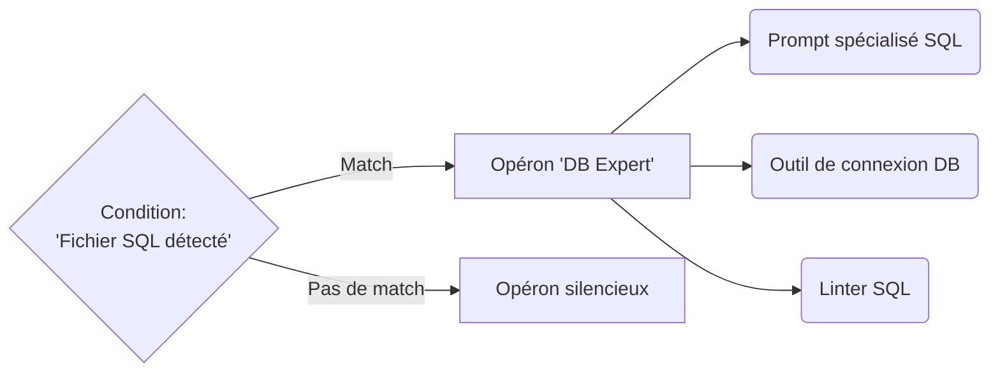

# 5. RÉGULATION GÉNIQUE

Ce document traite de la manière dont les gènes interagissent entre eux et se déclenchent conditionnellement dans GenOS.

---

## 5.1 Opérons et Promoteurs

### Ce que ça apporte à l'agent
En biologie, un opéron est un groupe de gènes régulés ensemble. Dans GenOS, un Operon est une **unité de compétence transférable en bloc** (un bundle contenant un sous-prompt, un outil MCP, et un validateur).
Le "promoteur" est la condition d'activation de ce bloc.
Cela apporte **la modularité extrême**. Plutôt que d'avoir un agent monolithique, l'agent est un assemblage d'opérons qu'il peut activer ou désactiver.

### Schéma Conceptuel

### Cas d'usage
- **Chargement à chaud de compétences** : Un agent généraliste navigue dans le code. S'il ouvre un fichier Docker, son promoteur "Docker" s'active et déploie l'opéron entier (les outils Docker et le contexte associé) dans sa mémoire de travail. Quand il quitte le fichier, l'opéron est réprimé (libérant les tokens).

### Différence par rapport aux concurrents
- **Concurrents** : Doivent fournir tous les outils (Tool Use / Function Calling) dès le début, saturant la fenêtre de contexte et augmentant le risque que l'agent utilise le mauvais outil.
- **GenOS** : Gestion granulaire de l'arsenal. Les outils sont physiquement couplés à leur contexte d'utilisation et ne s'activent que sur condition (promoteur).

---

## 5.2 Réseaux de Régulation (GRN)

### Ce que ça apporte à l'agent
Les gènes ne sont pas isolés, ils forment un réseau de régulation (Gene Regulatory Network). Un RegulatorGene est un gène dont le seul but est de moduler d'autres gènes sous certaines conditions.
Exemple : La règle "Si consecutive_failures > 3, alors module le drive d'exploration de +0.5" est une régulation cis (locale).
Cela apporte **l'homéostasie algorithmique**. L'agent s'auto-régule dynamiquement sans avoir besoin d'un script Python externe de supervision.

### Exemple Comparatif : Face à une tâche ambiguë
| Type d'Agent | Comportement | Conséquence |
|---|---|---|
| **Agent Simple** | Hallucine une réponse aléatoire. | Faux positif, erreur non détectée. |
| **Agent Expert** | Prompt ingénierisé avec "Si tu ne sais pas, demande." | Peut boucler sur des demandes de clarification inutiles. |
| **Worker GenOS** | Son Réseau de Régulation détecte une haute entropie (incertitude). Le RegulatorGene de doute réprime le gène d'Action et active le gène d'Investigation. | L'agent bascule de son propre chef d'un mode "Codeur" à un mode "Chercheur" jusqu'à ce que l'incertitude baisse. |
| **Orchestrateur GenOS** | Conçoit des topologies de GRN pour s'assurer que les workers ne tombent pas dans des boucles mortes (feed-forward loops, repressilateurs). | Les essaims sont stables et ne divergent pas. |
