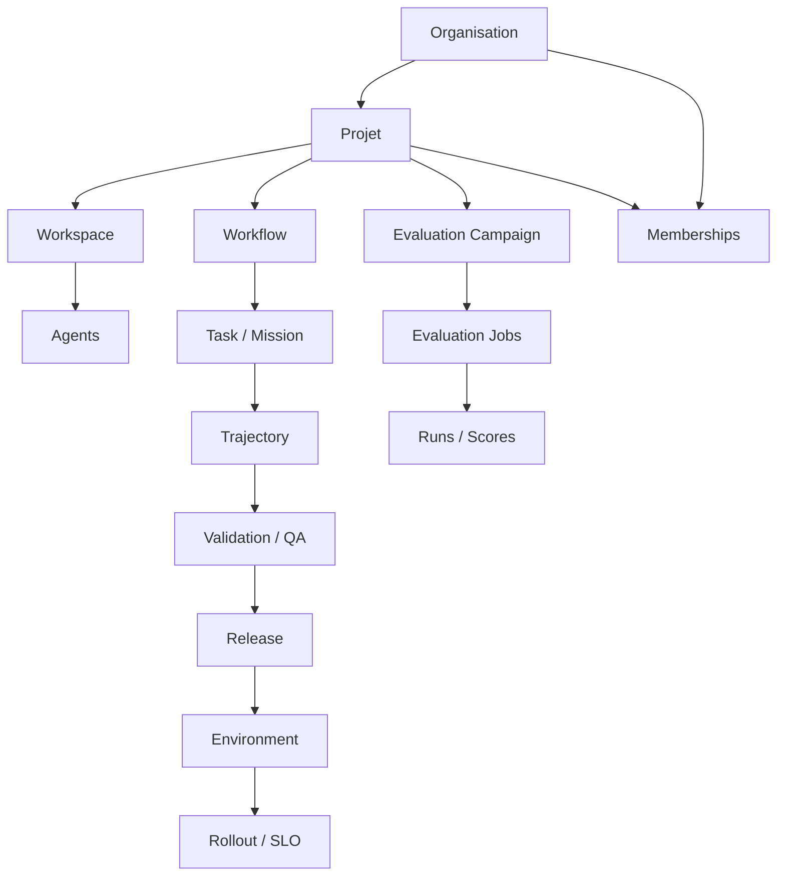

# Gestion de projet et multi-tenant dans GenOS

## 1. Définition

GenOS n’est pas seulement un framework d’agents IA : c’est une plateforme de contrôle pour exécuter des missions, des flux de travail, des expériences et des déploiements dans un contexte de multi-tenant, avec isolation stricte entre organisations et projets.

Le cœur du modèle est le suivant :

- une organisation regroupe un périmètre d’entreprise ou de groupe ;
- un projet appartient à une organisation et contient plusieurs workspaces ;
- un workspace est un environnement de travail de code / runtime / données ;
- les missions, workflows, trajets, évaluations et releases sont toujours rattachés à un tenant explicite ;
- les permissions sont calculées à la fois au niveau organisation et au niveau projet ;
- les ressources ne sont visibles que si leur organisation_id et project_id sont cohérents.

Le repo implémente cette logique dans plusieurs couches :

- le middleware de tenant : [backend/src/middleware/tenant.js](../backend/src/middleware/tenant.js)
- les routes de contrôle : [backend/src/routes/controlPlaneRoutes.js](../backend/src/routes/controlPlaneRoutes.js)
- les tables de schéma : [backend/src/db/schema-tables-extensions.js](../backend/src/db/schema-tables-extensions.js)
- les contrôleurs de workspace et workflow : [backend/src/controllers/workspaceController.js](../backend/src/controllers/workspaceController.js), [backend/src/controllers/workflowController.js](../backend/src/controllers/workflowController.js)
- le contrôleur de release : [backend/src/controllers/releaseController.js](../backend/src/controllers/releaseController.js)

L’objectif fonctionnel est de garantir que :

1. un membre ne puisse pas lire ou écrire des ressources d’un autre projet ;
2. une organisation soit indépendante d’une autre ;
3. les statuts d’un projet, d’un workspace, d’un workflow, d’une release et d’une campagne restent cohérents ;
4. les décisions d’IA, de code et de déploiement restent baties sur de la preuve et non sur des suppositions.

---

## 2. Modèle métier et objets de domaine

### 2.1 Organisation
Une organisation est l’isolant de niveau 1.

Dans le schéma, une organisation contient :

- id
- name
- created_at

La table de référence est :

- organizations

Les politiques d’accès sont gérées avec :

- organization_memberships
- rôle autorisé : owner, admin, member, viewer

### 2.2 Projet
Un projet appartient obligatoirement à une organisation.

Le schéma impose :

- project_id non nul si organization_id non nul ;
- project_id doit appartenir à l’organisation donnée ;
- un nom de projet est unique au sein d’une organisation.

Les états métier autorisés :

- active
- archived

Exemple de logique dans le repo :

- création de project : [backend/src/routes/controlPlaneRoutes.js](../backend/src/routes/controlPlaneRoutes.js)
- archive/restauration : idem ; la restauration repasse le projet en active
- cohérence avec les workspaces : les workspaces associés sont archivés ou restaurés en même temps

### 2.3 Workspace
Un workspace est le conteneur de travail concret : un dossier local/isolé, un dépôt de code, un environnement de développement ou d’expérimentation.

Ses attributs principaux :

- id
- name
- path
- visibility : Private / Public
- language
- description
- tags
- is_archived
- organization_id
- project_id

Le repo impose l’intégrité globale :

- un workspace project_id sans organization_id est refusé ;
- un workspace ne peut pas pointer vers un projet hors de son organisation ;
- le nom du workspace est unique par couple organisation/projet.

Cas d’usage réel :

- workspace principal du projet ;
- workspace de fork / expérimentation ;
- workspace de démonstration ou de sandbox ;
- workspace d’évaluation ou d’arène.

### 2.4 Missions, tâches, workflows et jalons
Le repo dispose de modèles pour :

- agents : [backend/src/db/schema-tables-core.js](../backend/src/db/schema-tables-core.js)
- workflows : [backend/src/db/schema-tables-extensions.js](../backend/src/db/schema-tables-extensions.js)
- trajectories : [backend/src/db/schema-tables-core.js](../backend/src/db/schema-tables-core.js)
- evaluations : [backend/src/db/schema-tables-extensions.js](../backend/src/db/schema-tables-extensions.js)

Le niveau métier est conceptuellement :

- mission = but ou besoin de l’organisation / du projet ;
- tâche = étape concrète de la mission ;
- workflow = graphe de tâches ordonnées et valides ;
- jalon = point de contrôle d’un objectif majeur ;
- trajectory = proposition de code ou de plan à valider.

### 2.5 Trajectoires, propositions de code et validation
Le système connaît explicitement des trajectories :

- id
- workspace_id
- author_id
- reviewer_id
- title
- status
- semantic_summary
- qa_feedback
- diff_file
- diff_stats
- confidence
- adversarial_result
- future_ci_result

Statuts :

- pending
- active
- approved
- rejected
- revising

C’est le mécanisme de gouvernance de proposition :

- un agent ou un membre crée une proposition ;
- la proposition est évaluée ;
- elle est acceptée, rejetée ou renvoyée en révision ;
- si acceptée, elle peut être activée et fusionnée dans le workspace.

### 2.6 Expériences et campagnes d’évaluation
Le repo expose :

- evaluation_campaigns
- datasets
- dataset_cases
- evaluation_jobs
- evaluation_runs

Un modèle utile est :

- campaign = ensemble d’évaluations ;
- job = exécution de test/evaluation sur un dataset ;
- run = résultat de benchmark ou score ;
- dataset = corpus d’entrées / attentes.

Statuts :

- planned
- running
- completed
- failed
- cancelled

Le contrôleur [backend/src/controllers/evalController.js](../backend/src/controllers/evalController.js) démontre la logique de création et de listing par scope tenant.

### 2.7 Environnements, releases et déploiements
Le schéma contient :

- environments
- releases
- release_rollouts
- release_rollout_metrics
- release_slo_policies

Les règles importantes dans le repo :

- un release doit être rattaché à un workflow du même tenant ;
- la promotion dépend d’un rollout réussi ;
- l’environnement ne peut être staging ou production ;
- les metrics de rollout sont agrégées et scannées par SLO.

Cela donne une séparation claire entre :

- workflow de planification ;
- version de workflow ;
- release de version ;
- rollout progressif ;
- décision de promotion.

---

## 3. Mathématiques du multi-tenant

### 3.1 Isolation par scope
La règle de base est :

$$
\text{resource.scope} = (organizationId, projectId)
$$

et toute lecture / écriture doit vérifier :

$$
\text{resource.organizationId} = \text{request.organizationId} \land \text{resource.projectId} = \text{request.projectId}
$$

Le fichier [backend/src/middleware/tenant.js](../backend/src/middleware/tenant.js) applique exactement cette logique via resolveTenant et scopeSql.

Si l’un des deux champs manque, la requête est refusée :

$$
\text{organizationId} \oplus \text{projectId} = 1
$$

Autrement dit, les deux doivent être présents ensemble.

### 3.2 Vérification d’accès
Un principal n’a accès que s’il est membre de l’organisation et/ou du projet :

$$
\text{authorized}(u, o, p) = \text{memberOrg}(u, o) \land \text{projectVisible}(u, p)
$$

avec visibilité calculée dans le repo par:

- organization_memberships
- project_memberships
- rôles owner, admin, member, viewer

Et un bypass global n’est accordé qu’aux comptes avec permission all.

### 3.3 Statuts comme machine à états
Les transitions sont contraintes par ensembles.

Exemple pour les workflows :

$$
T_{workflow} = \{
\text{draft}, \text{staging}, \text{published}, \text{archived}
\}
$$

avec transitions légalement autorisées :

- draft → draft, staging, archived
- staging → staging, published, draft, archived
- published → published, archived
- archived → archived

Le code l’exprime par WORKFLOW_TRANSITIONS dans [backend/src/controllers/workflowController.js](../backend/src/controllers/workflowController.js).

Pour les projets :

$$
T_{project} = \{\text{active}, \text{archived}\}
$$

et l’archive d’un projet active simultanément l’archive de ses workspaces.

### 3.4 Contrôle de cohérence
La cohérence métier est fondée sur la propriété de fermeture :

$$
\forall r \in Resources, \; scope(r) \in Organization \times Project
$$

et les tables imposent aussi :

$$
\text{workspace.projectId} \in \text{projects.id} \land \text{workspace.organizationId} = \text{project.organizationId}
$$

C’est exactement ce que garantit le trigger SQL dans [backend/src/db/schema-tables-extensions.js](../backend/src/db/schema-tables-extensions.js).

---

## 4. Équivalence biologique et interprétation du modèle

GenOS emploie un vocabulaire biologique pour rendre le système plus lisible, mais la logique réelle est fonctionnelle et rigide.

### 4.1 Analogies utiles

- organisation = niche écologique / cellule mère ;
- projet = organe / sous-système ;
- workspace = cellule de travail ;
- workflow = morphogenèse ordonnée ;
- trajectory = hypothèse évolutive ;
- release = phénotype stabilisé ;
- evaluation campaign = stress test / évolution sélective ;
- agent = cellule spécialisée dans un rôle spécifique.

### 4.2 Ce que cela apporte au produit
La métaphore biologique aide à structurer :

- isolation cellulaire ;
- spécialisation de rôle ;
- reproduction et mutation contrôlée ;
- sélection d’hypothèses ;
- passage par preuves / validation avant promotion.

### 4.3 Limite importante
Dans GenOS, cette dimension est 
fonctionnelle et gouvernée par des tables SQL, des triggers et des contrôleurs. Elle n’est pas une simulation biologique ou une promesse de vie artificielle : c’est un langage de conception, pas un argument de sécurité absolue.

---

## 5. Cas d’utilisation principaux

### 5.1 Multi-tenant SaaS de développement IA
Une société a plusieurs divisions :

- organisation = entreprise ;
- projet = produit ;
- workspace = équipe ou microservice ;
- workflow = pipeline de livraison ;
- release = version déployée.

### 5.2 Collaboration entre équipes
Les rôles permettent de séparer :

- owner = décision stratégique ;
- admin = administration du tenant ;
- member = exécution ;
- viewer = consultation.

### 5.3 Validation code + preuve
Une trajectory peut être :

- créée par un agent ;
- évaluée par tests ;
- rejetée si preuve insuffisante ;
- acceptée si elle passe les gates de qualité ;
- activée dans un workspace ou un workflow.

### 5.4 Expériences de benchmark
Une campagne de benchmark compare plusieurs configurations pour :

- modéliser une tâche ;
- lancer des jobs ;
- enregistrer scores et costs ;
- comparer avec des seuils ;
- décider d’un changement de plan.

### 5.5 Progressive delivery
Une release est livrée en canary / AB avec :

- SLO ;
- métriques ;
- seuil d’erreurs ;
- promesse et rollback potentiel.

---

## 6. Exemple de parcours complet

### Exemple : lancement d’un projet de produit IA

1. Création de l’organisation
   - organization = Acme Labs

2. Création du projet
   - project = Customer Support Copilot
   - project.organization_id = org-123

3. Ajout de membres
   - owner : CTO
   - admin : lead platform
   - member : ingénieurs, évaluateurs
   - viewer : managers

4. Création des workspaces
   - workspace backend
   - workspace evaluator
   - workspace sandbox

5. Création d’un workflow
   - graph de tâches : collect → tri → synthèse → validation → release
   - statut initial : draft

6. Exécution du workflow
   - passage en staging ;
   - création d’une version ;
   - création de la release ;
   - publication du rollout canary.

7. Validation métier
   - evaluation_campaigns calculent les résultats ;
   - les scores sont comparés aux seuils ;
   - la release est validée ou non.

8. Promotion ou blocage
   - si seuils ok : release active ;
   - si non : status blocked ou failed ;
   - la trajectoire est rejetée ou revisée.

---

## 7. Schéma d’architecture

### Architecture logique du repo

- Couche 1 : contrôle identité et scopes
  - [backend/src/middleware/tenant.js](../backend/src/middleware/tenant.js)
  - [backend/src/routes/controlPlaneRoutes.js](../backend/src/routes/controlPlaneRoutes.js)

- Couche 2 : persistance et intégrité
  - [backend/src/db/schema-tables-core.js](../backend/src/db/schema-tables-core.js)
  - [backend/src/db/schema-tables-extensions.js](../backend/src/db/schema-tables-extensions.js)

- Couche 3 : runtime de travail
  - [backend/src/controllers/workspaceController.js](../backend/src/controllers/workspaceController.js)
  - [backend/src/controllers/workflowController.js](../backend/src/controllers/workflowController.js)
  - [backend/src/controllers/releaseController.js](../backend/src/controllers/releaseController.js)

- Couche 4 : IA / orchestration
  - agents, trajectories, decisions, provenance, workflows

---

## 8. Processus métier recommandé

### 8.1 Cycle de vie d’un projet

1. Création de l’organisation
2. Création du projet dans l’organisation
3. Attribution de rôles
4. Création du workspace
5. Définition du workflow
6. Exécution de tâches / missions
7. Évaluation de trajectoires
8. Validation des preuves
9. Release dans un environnement
10. Rollout progressif
11. Promotion ou rollback
12. Archivage du projet

### 8.2 Règle de validation
Le système concrétise une politique de preuve :

- pas de décision sans scope tenant ;
- pas de release sans workflow validé ;
- pas de promotion sans rollout ou override explicite ;
- pas de validation d’un projet si le statut est archived ;
- pas de workspace hors organisation projet.

### 8.3 Cohérence des statuts
Le code applique aussi des transitions métier strictes, par exemple :

- un workflow publié ne devient pas modifiable sans créer une nouvelle version ;
- un projet archived est read-only ;
- un rollout running ne peut pas être remplacé sans clôture ;
- une release ne peut pas être promue sans conditions SLO.

---

## 9. Points forts de l’implémentation GenOS

- isolation tenant native au niveau SQL et middleware ;
- modèle de rôles explicite et contrôlé ;
- workspaces projetés dans le bon périmètre ;
- workflows avec validation de graphe et versionnement ;
- releases et rollout alignés sur I/O réel et SLO ;
- campagnes d’évaluation à la fois pour tests et score ;
- trajectoires comme mécanisme de revue et de validation.

---

## 10. Comparaison avec le marché

### 10.1 Jira / Atlassian
Points communs :

- projets, users, rôles, workflows
- sprints / milestones / status

Différences :

- GenOS est plus orienté IA agentique et preuve de vérification ;
- le repo ajoute un modèle d’exécution de workflow, une arène d’évaluation et un système de release progressive ;
- GenOS n’est pas seulement un backlog, c’est aussi un runtime de validation et d’orchestration.

### 10.2 Linear
Points communs :

- organisation, projets, membres, tâches, workflows, sprints, cycles de validation

Différences :

- GenOS inclut des concepts de workspace, de trajectory, de release et de rollout ;
- le système a un niveau de gouvernance tenant fort et de cohabitation multi-organisation.

### 10.3 GitLab / Azure DevOps
Points communs :

- repos, pipelines, environments, releases, approbation

Différences :

- GenOS se distingue par son attitude d’agent + validation + expérimentation ;
- il unit les dimensions de code, d’évaluation, d’agent et de release en un seul système de gouvernance.

### 10.4 Asana / monday.com / ClickUp
Points communs :

- gestion de projets, tâches, membres, statuts

Différences :

- ces plateformes sont orientées collaboration humaine ;
- GenOS est orienté orchestration de travail autonome, preuve, exécution contrôlée et multi-tenant technique.

### 10.5 Positionnement GenOS
GenOS se place entre :

- les outils de PM classiques ;
- les plateformes de CI/CD ;
- les runtimes d’agents IA ;
- les systèmes d’évaluation de modèles.

Sa valeur ajoutée est la convergence de ces dimensions dans un cadre cohérent :

- scoping tenant ;
- projet / workspace / workflow ;
- release / rollout ;
- evidence-driven validation ;
- orchestration d’agents et revue de propositions.

---

## 11. Synthèse

Le module de gestion de projet et multi-tenant de GenOS s’appuie sur une architecture simple mais stricte :

- organisation = périmètre de sécurité ;
- projet = unité de livraison ;
- workspace = environnement d’exécution ;
- workflow = mécanisme de coordination ;
- trajectory = proposition de changement ;
- campaign = évaluation ;
- release = livrable promu ;
- rollout = gouvernance progressive de la diffusion.

Ce qui fait la force de l’implémentation n’est pas seulement la présence de tables ou de routes, mais la cohérence entre :

- la hiérarchie des objets ;
- les roles utilisateur ;
- les statuts métier ;
- les validateurs de scope ;
- les garanties de sécurité implicites dans le schéma.

Le système montre ainsi une vraie logique d’entreprise pour l’IA agentique : gestion de projets multi-tenant, coordination de flux, validation de preuve, expérimentation contrôlée et livraison sécurisée.
