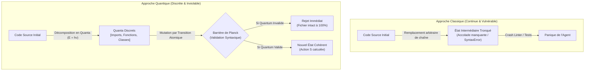

# Quantum VFS — Pilier 1 : La Quantification (Les Quanta d'Édition)

## 1. Fondement Physique : L'Énergie par Paquets ($E = h\nu$)

En physique quantique, l'énergie n'est pas une grandeur continue. Elle ne peut être émise ou absorbée que par multiples entiers d'une quantité élémentaire indivisible appelée **quantum** :

$$E = h\nu$$

*(où $h \approx 6.626 \times 10^{-34} \text{ J}\cdot\text{s}$ est la constante de Planck)*

Un oscillateur harmonique ou un électron en orbite ne peut pas sauter d'un demi-niveau d'énergie : soit le saut complet a lieu, soit le système reste dans son état fondamental.

---

## 2. Transposition Logicielle : L'AST-Quantum

Dans un système de fichiers classique, les agents manipulent le code sous forme de flux de caractères bruts (strings continus). Cette approche expose le système à des états intermédiaires corrompus :
- Accolade ou parenthèse oubliée en cours d'édition.
- Demi-déclaration de fonction entraînant une erreur de parsing immédiate.
- Échec en cascade des linters et des tests avant même que l'agent n'ait pu compléter son intention.

Le **Quantum VFS** introduit la notion d'**AST-Quantum** (`AstQuantum`) : toute modification de fichier est décomposée en une transition discrète de quanta syntaxiques complets et auto-cohérents.



---

## 3. Caractéristiques des Quanta de Fichiers

Chaque quantum possède :
- **Un identifiant et une signature cryptographique (`hash`)** : Permet l'adressage par contenu et la détection d'intégrité.
- **Un type syntaxique normalisé (`QuantumType`)** : `IMPORT_BLOCK`, `FUNCTION`, `CLASS`, `VARIABLE_DECLARATION`, `INTERFACE_TYPE`, `EXPORT_BLOCK`, `ATOMIC_STATEMENT`.
- **Une énergie d'action ($E_i$)** : Énergie syntaxique proportionnelle à la complexité et au volume de l'instruction.
- **La Barrière de Planck (`validate()`)** : Vérification stricte du confinement (équilibrage parfait des accolades, crochets et parenthèses). Tout quantum non fermé est rejeté par la barrière.

---

## 4. Exemple d'Utilisation dans GenOS

```javascript
const { decomposeIntoQuanta, applyQuantumTransition, AstQuantum, QuantumType } = require('../services/quantumVfs/quantumAst');

// 1. Décomposition du code source en paquets discrets
const quanta = decomposeIntoQuanta(sourceCode);

// 2. Création d'un nouveau quantum de fonction
const newFunctionQuantum = new AstQuantum({
  type: QuantumType.FUNCTION,
  content: `function secureHash(input) {\n  return crypto.createHash('sha256').update(input).digest('hex');\n}`
});

// 3. Application d'une transition quantique atomique
const result = applyQuantumTransition(sourceCode, [
  { action: 'replace', targetHash: targetQuantumHash, quantum: newFunctionQuantum }
]);

console.log(`Transition réussie ! Nombre de quanta : ${result.quantaCount}, Potentiel d'action : ${result.actionPotential}`);
```
