# Quantum VFS — Pilier 2 : La Dualité Onde-Corpuscule

## 1. Fondement Physique : L'Onde de De Broglie & Les Fentes de Young

En mécanique quantique, la lumière et la matière manifestent une nature à la fois ondulatoire et corpusculaire. Louis de Broglie a postulé en 1924 que toute particule de quantité de mouvement $p$ possède une longueur d'onde associée $\lambda$ :

$$\lambda = \frac{h}{p}$$

Dans l'**expérience des fentes de Young**, les particules tirées une par une créent des franges d'interférence caractéristiques des ondes, mais s'enregistrent sur l'écran détecteur sous forme d'impacts granulaires discrets.

---

## 2. Transposition Logicielle : Le Fichier Onde-Corpuscule

Un fichier dans le **Quantum VFS** n'est plus simplement un tableau d'octets statique :
- **État Corpusculaire (`CorpuscularState`)** : Code source discret, syntaxe tokenisée, taille physique en octets et empreinte cryptographique SHA-256. C'est la forme requise par le moteur d'exécution Node.js, le compilateur Rust `rustc`, les tests `npm test` ou les outils d'inspection statique.
- **État Ondulatoire (`WaveState`)** : Vecteur continu dans l'espace d'embedding latent 768-D, doté d'une phase $\phi$ et d'une fréquence sémantique. Cet état permet à l'agent d'évaluer la compatibilité, la résonance ou la dissonance d'un patch avant toute écriture.

```mermaid
flowchart LR
    subgraph DualFile["WaveParticleFile : Double Nature du Fichier"]
        direction TB
        subgraph Corpuscle["1. Nature Corpusculaire (Discrète)"]
            C1["Texte brut (UTF-8)"]
            C2["Hash SHA-256"]
            C3["Tokens & Lignes discrètes"]
            C4["Exécution Runtime & Compilateur"]
        end

        subgraph Wave["2. Nature Ondulatoire (Continue)"]
            W1["Vecteur Latent 768-D"]
            W2["Longueur d'onde λ = h / p"]
            W3["Phase sémantique φ"]
            W4["Interférence Constructive / Destructive"]
        end
    end

    Intent["🧠 Intention de l'Agent"] -->|"Projection Ondulatoire"| Wave
    Wave -->|"Interférence Constructive (Score > 0.25)"| Transition["Validation Sémantique"]
    Transition -->|"Effondrement / Matérialisation"| Corpuscle
    Corpuscle -->|"Persistance"| Disk["💾 Disque / VFS"]
```



---

## 3. Calcul d'Interférence Sémantique

L'intensité d'interférence $I$ entre deux fichiers (ou entre l'intention d'un agent et un fichier existant) est calculée selon l'équation de superposition des ondes cohérentes :

$$I = \vec{\psi}_A \cdot \vec{\psi}_B \times \cos(\Delta\phi)$$

- **Interférence Constructive ($I \ge 0.25$)** : Les deux entités sont en harmonie architecturale. Leurs intentions s'amplifient mutuellement.
- **Interférence Destructive ($I \le -0.20$)** : Dissonance sémantique ou conflit fonctionnel majeur (ex. contradiction dans les exigences, collision de contrats).
- **Zone Neutre ($-0.20 < I < 0.25$)** : Faible corrélation, modifications orthogonales sans risque de collision.

---

## 4. Exemple d'Utilisation dans GenOS

```javascript
const { WaveParticleFile, calculateSemanticInterference } = require('../services/quantumVfs/waveParticleFile');

// 1. Instanciation du fichier dual (code + onde vectorielle)
const apiFile = new WaveParticleFile(serverSourceCode, 'src/server.js', 0.0);

// 2. Proposition de modification par un agent sous-jacent
const proposalFile = new WaveParticleFile(newRouteCode, 'src/routes.js', 0.0);

// 3. Calcul d'interférence avant application
const interference = calculateSemanticInterference(apiFile, proposalFile);

if (interference.isResonant) {
  console.log(`✅ Résonance constructive (Score: ${interference.interferenceScore}). Application autorisée.`);
  apiFile.mutateContent(newRouteCode);
} else {
  console.warn(`⚠️ Dissonance détectée : interférence destructive (${interference.interferenceScore}).`);
}
```
