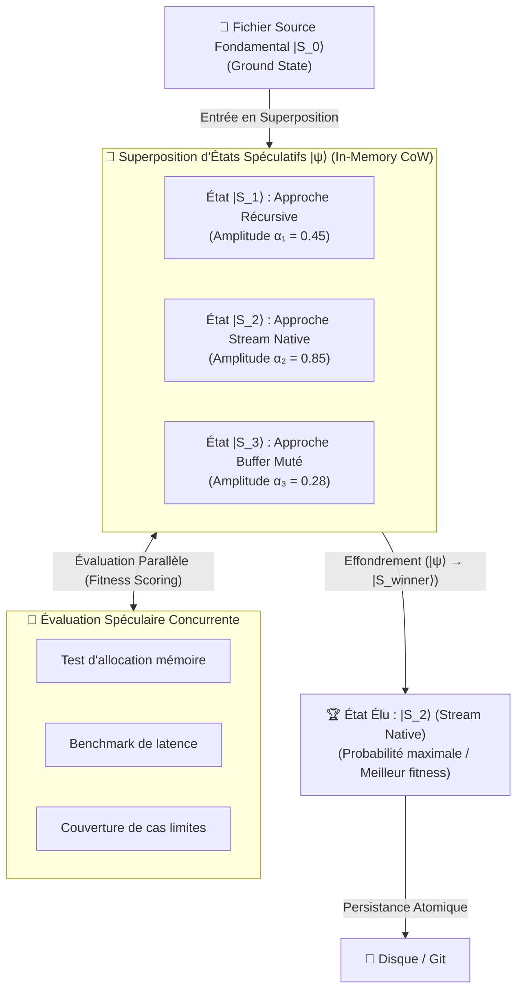

# Quantum VFS — Pilier 3 : La Superposition Quantique

## 1. Fondement Physique : Combinaison Linéaire d'États ($|\psi\rangle$)

Le principe de superposition stipule qu'un système physique quantique peut se trouver simultanément dans une combinaison linéaire de plusieurs états propres mutuellement exclusifs :

$$|\psi\rangle = \sum_{i=1}^{n} \alpha_i |S_i\rangle \quad \text{avec} \quad \sum_{i=1}^{n} |\alpha_i|^2 = 1$$

Où $\alpha_i \in \mathbb{C}$ est l'amplitude de probabilité associée à l'état propre $|S_i\rangle$, et $|\alpha_i|^2$ représente la probabilité de mesurer le système dans cet état lors d'une observation.

Tant qu'aucune mesure n'est réalisée, le système **explore l'ensemble de ces configurations en parallèle**.

---

## 2. Transposition Logicielle : Fichiers Multi-États Spéculatifs

Dans la gestion classique des dépôts de code, l'exploration de plusieurs variantes architecturales (ex. itérative, fluxée, parallélisée) impose soit :
- Des commits séquentiels destructifs.
- La création de branches Git multiples et lourdes.
- Des conflits de merge complexes lors de l'intégration.

Le **Quantum VFS** permet à un même descripteur de fichier d'entrer dans un état de **Superposition Quantique (`QuantumSuperposition`)** :



---

## 3. Mécanique de l'Effondrement Spéculatif

1. **Initialisation de la superposition** : Le fichier démarre dans son état fondamental $|S_0\rangle$ ($\alpha_0 = 1.0$).
2. **Branches spéculatives** : Des agents ou sous-agents greffent des hypothèses alternatives ($|S_1\rangle, |S_2\rangle, \dots$). Les amplitudes sont automatiquement normalisées pour satisfaire $\sum |\alpha_i|^2 = 1$.
3. **Évaluation parallèle (`evaluateSuperposition`)** : Des tests virtuels (sans impact disque) attribuent des scores de fitness modulant les amplitudes $\alpha_i$.
4. **Effondrement (`collapse`)** : La fonction d'onde s'effondre selon la stratégie choisie (`highest_probability`, `highest_fitness`), fixant le contenu vainqueur et verrouillant l'état contre toute mutation ultérieure.

---

## 4. Exemple d'Utilisation dans GenOS

```javascript
const { QuantumSuperposition } = require('../services/quantumVfs/superpositionEngine');

// 1. Mise en superposition d'un module algorithmique
const superposition = new QuantumSuperposition(initialCode, 'src/sorter.js');

// 2. Proposition de variantes par deux agents spécialisés
superposition.addEigenstate('quicksort_in_place', codeVarianteA, 1.0);
superposition.addEigenstate('timsort_optimized', codeVarianteB, 1.2);

// 3. Évaluation automatique des candidats
await superposition.evaluateSuperposition(async (content, state) => {
  const benchmarkScore = await runMicroBenchmark(content);
  return benchmarkScore; // 0.0 à 1.0
});

// 4. Cristallisation déterministe
const finalState = superposition.collapse('highest_fitness');
console.log(`Variante sélectionnée : ${finalState.label} avec probabilité ${finalState.probabilityAtCollapse}`);
```
