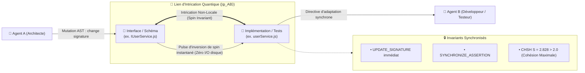

# Quantum VFS — Pilier 4 : L'Intrication Quantique

## 1. Fondement Physique : L'Action Fantôme à Distance & Le Théorème de Bell

L'intrication quantique décrit un état physique conjoint où deux particules $A$ et $B$ forment un tout inséparable :

$$|\psi_{AB}\rangle \neq |\psi_A\rangle \otimes |\psi_B\rangle$$

Même séparées par des années-lumière, une mesure sur la particule $A$ (ex. spin haut $\uparrow$) détermine **instantanément** et sans délai de transmission le spin de la particule $B$ (spin bas $\downarrow$).

Le physicien John Bell (1964) puis Alain Aspect (1982, Prix Nobel 2022) ont démontré que les corrélations quantiques violent la limite classique imposée par l'inégalité CHSH :

$$|S_{\text{classique}}| \le 2 \quad \text{alors que} \quad |S_{\text{quantique}}| \le 2\sqrt{2} \approx 2.828$$

---

## 2. Transposition Logicielle : Paires de Fichiers Intriqués (`EntangledPair`)

Dans les architectures multi-agents classiques, les fichiers dépendants souffrent de déphasage temporel :
- Un agent modifie une interface ou une table SQL.
- L'agent responsable de l'implémentation ou des tests n'est pas alerté avant la prochaine passe de linter ou le prochain échec de build sur disque.
- Les conflits de contrat s'accumulent.

Le **Quantum VFS** introduit l'**Intrication de Fichiers** :



---

## 3. Modes d'Intrication Reconnus

Le moteur `QuantumEntanglementRegistry` gère quatre modes natifs d'intrication :
1. **`INTERFACE_IMPLEMENTATION`** : Couplage direct entre la signature d'un contrat et ses réalisations concrètes.
2. **`SCHEMA_MIGRATION`** : Alignement synchrone entre modèles de données et scripts de migration SQL.
3. **`SOURCE_TEST`** : Synchronisation obligatoire entre logique métier et suites d'assertions.
4. **`BIDIRECTIONAL_INVARIANT`** : Maintien continu d'équilibres inter-systèmes (ex. client gRPC $\iff$ serveur gRPC).

---

## 4. Exemple d'Utilisation dans GenOS

```javascript
const { QuantumEntanglementRegistry, EntanglementMode } = require('../services/quantumVfs/entanglementEngine');

const registry = new QuantumEntanglementRegistry();

// 1. Déclaration de l'intrication
registry.entangle('src/contracts/auth.proto', 'src/services/authService.js', EntanglementMode.INTERFACE_IMPLEMENTATION);

// 2. Mutation sur le contrat
const result = registry.propagateMutation('src/contracts/auth.proto', {
  signatureChanged: true,
  newSignature: 'rpc AuthenticateUser(AuthRequest) returns (AuthToken);'
});

// 3. Réception de la directive d'adaptation sans attente d'I/O
console.log(`Fichiers alertés : ${result.signalsCount}`);
console.log(`Action requise pour le partenaire : ${result.signals[0].requiredAdaptations[0].action}`);
```
