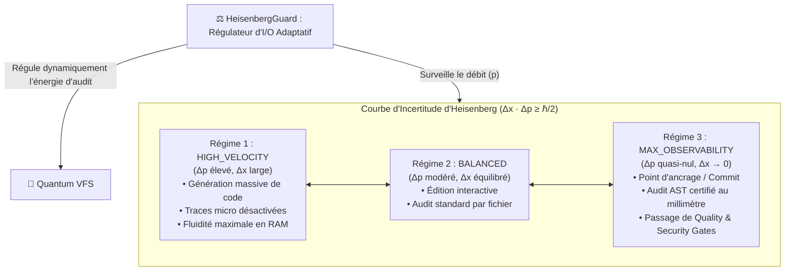

# Quantum VFS — Pilier 5 : Le Principe d'Incertitude d'Heisenberg

## 1. Fondement Physique : L'Incertitude Fondamentale

Formulé en 1927 par Werner Heisenberg, le principe d'incertitude établit qu'il est impossible de connaître avec une précision infinie et simultanée deux grandeurs conjuguées, telles que la position spatiale $x$ et la quantité de mouvement $p$ :

$$\Delta x \cdot \Delta p \ge \frac{\hbar}{2}$$

Plus on affine la précision sur la localisation d'une particule ($\Delta x \to 0$), plus l'incertitude sur sa quantité de mouvement tend vers l'infini ($\Delta p \to \infty$).

---

## 2. Transposition Logicielle : Compromis Vélocité vs Précision d'Audit

Dans les architectures d'agents logiciels, une friction majeure existe entre deux exigences opposées :
1. **L'exigence d'auditabilité absolue** : Logger, hasher, tracer, parser et persister chaque micro-caractère modifié sur le disque.
2. **L'exigence de vélocité cognitive** : Permettre à l'agent de générer et restructurer des modules à haut débit sans blocage d'I/O ni goulot d'étranglement de tracing.

Le **Quantum VFS** applique l'inégalité d'Heisenberg sous la forme :

$$\Delta(\text{Localisation d'Audit}) \cdot \Delta(\text{Vélocité de Génération}) \ge \frac{\hbar}{2}$$



---

## 3. Les Trois Régimes d'I/O Quantiques

- **`HIGH_VELOCITY` ($\Delta p \ge 2.0$)** : Lorsque l'agent génère ou refactore intensivement, le système relâche l'audit microscopique (`auditLevel = 'shallow'`). Seuls les hashs globaux sont surveillés en mémoire, éliminant tout blocage d'I/O.
- **`BALANCED` ($0.3 < \Delta p < 2.0$)** : Mode standard de pair-programming, maintien d'une traçabilité équilibrée.
- **`MAX_OBSERVABILITY` ($\Delta p \le 0.3$)** : Lors des franchissements de barrières critiques (pre-commit, scans CodeQL, runs de tests unitaires, audits de conformité), le momentum est gelé (`freezeForMeasurement`). La traçabilité devient absolue ($\Delta x \to 0$).

---

## 4. Exemple d'Utilisation dans GenOS

```javascript
const { HeisenbergGuard, HeisenbergRegime } = require('../services/quantumVfs/heisenbergGuard');

const guard = new HeisenbergGuard();

// 1. Détection automatique du régime lors d'une rafale de modifications
guard.recordPulse(4.0);
guard.recordPulse(3.8);

let status = guard.calibrateObservability();
console.log(`Régime actif : ${status.regime}`); // HIGH_VELOCITY
console.log(`Profondeur d'audit autorisée : ${status.auditLevel}`); // 'shallow'

// 2. Point d'arrêt pour certification de sécurité
const freezeReport = guard.freezeForMeasurement('PRE_COMMIT_SECURITY_GATE');
console.log(`État figé : ${freezeReport.certifiedPrecision}`); // 'ABSOLUTE_ACCURACY'
```
