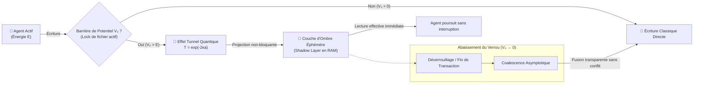

# Quantum VFS — Pilier 6 : L'Effet Tunnel

## 1. Fondement Physique : Le Franchissement de Barrière de Potentiel

En mécanique classique, si une bille d'énergie cinétique $E$ rencontre une colline de hauteur potentielle $V_0 > E$, elle rebrousse chemin systématiquement.

En mécanique quantique, la fonction d'onde d'une particule s'atténue de manière exponentielle dans la barrière sans s'annuler totalement. Si la barrière a une épaisseur finie $a$, l'onde émerge de l'autre côté avec une amplitude non nulle. C'est l'**effet tunnel**, régi par le coefficient de transmission $T$ (formule de Gamow) :

$$T \approx \exp(-2\kappa a) \quad \text{avec} \quad \kappa = \frac{\sqrt{2m(V_0 - E)}}{\hbar}$$

Ce phénomène est notamment à l'origine de la désintégration alpha et de la fusion thermonucléaire au cœur des étoiles.

---

## 2. Transposition Logicielle : Traversée des Verrous & Anti-Deadlocks

Dans un système de fichiers classique à agents concurrents :
- Un fichier verrouillé (par une transaction de base de données, un watcher IDE ou un agent concurrent) lève une exception (`EBUSY`, `EACCES`) ou plonge l'agent dans un **deadlock bloquant**.
- L'agent reste figé ou échoue prématurément.

Le **Quantum VFS** implémente le principe de **Tunneling I/O (`TunnelingWriter`)** :



---

## 3. Les Trois Propriétés Clés du TunnelingWriter

1. **Calcul du coefficient $T$** : Si l'énergie de l'agent $E \ge V_0$, la traversée est classique. Si $E < V_0$, la transmission est quantique et l'écriture est projetée dans une couche d'ombre avec probabilité $T > 0$.
2. **Lecture effective transparente (`readEffective`)** : L'agent dispose d'une vue continue du fichier incluant sa propre couche d'ombre sans attendre la levée du verrou physique.
3. **Coalescence asymptotique (`clearBarrier` / `coalesceShadow`)** : Dès que le verrou concurrent est libéré, l'état ombre est absorbé sans latence dans la copie canonique, garantissant l'absence totale de deadlock.

---

## 4. Exemple d'Utilisation dans GenOS

```javascript
const { TunnelingWriter } = require('../services/quantumVfs/tunnelingWriter');

const writer = new TunnelingWriter();

// 1. Verrouillage du fichier par un processus concurrent
writer.setBarrier('config/database.json', 3.0, 1.0, 'MIGRATION_LOCK');

// 2. L'agent tente d'écrire : au lieu de crasher, l'écriture tunnelise
const writeResult = writer.writeWithTunneling('config/database.json', newConfigContent, 1.5);
console.log(`Statut : ${writeResult.status}`); // QUANTUM_TUNNELED_SHADOW_PROJECTED
console.log(`Probabilité de transmission T : ${writeResult.transmissionProbability}`);

// 3. Dès la fin de la migration concurrente, coalescence automatique
writer.clearBarrier('config/database.json');
```
